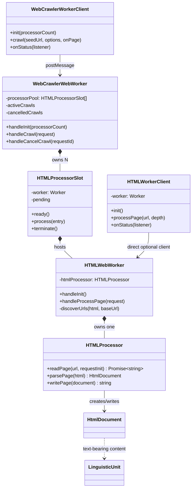
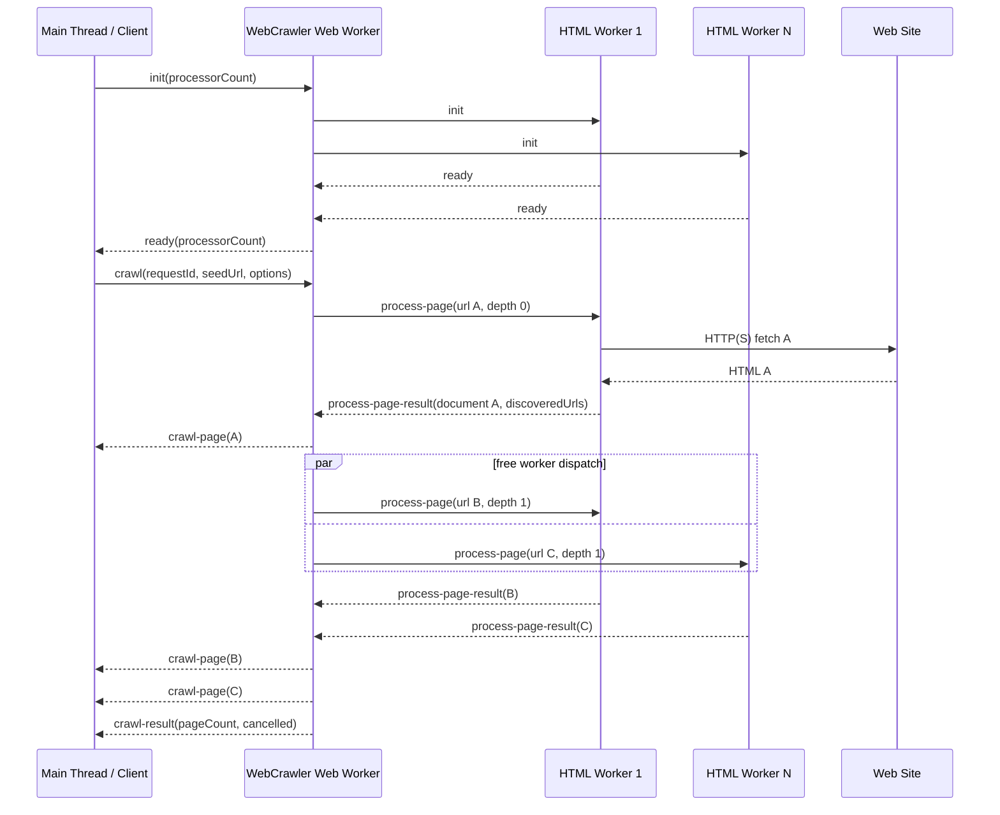
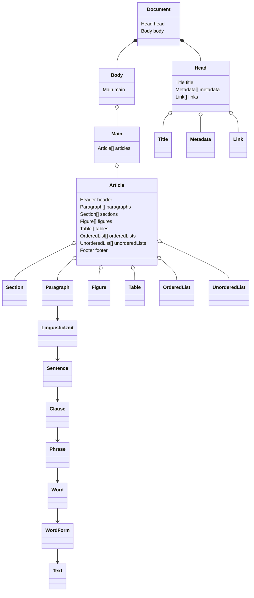
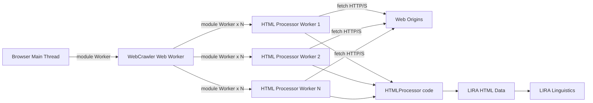

# HTML Crawler & Document Processor Architecture

**LIRA Layer:** Linguistics  
**Architecture Scope:** Web page discovery, HTML acquisition, HTML document processing, HTML-aligned LIRA data, and Web Worker service boundaries  
**Implementation Root:** `prototype/src/lira/linguistics/`  
**Status:** Architecture baseline for the prototype

---

# 1. Requirements View

## 1.1 Functional Requirements

The HTML Crawler & Document Processor provides a standards-aligned ingestion boundary between web pages and LIRA Linguistics. The crawler discovers and schedules pages. HTML Processor Web Workers acquire and parse individual pages. HTML structure is retained as typed LIRA HTML data; natural-language text is passed toward the existing `LinguisticUnit` hierarchy rather than being treated as an unstructured page string.

| Requirement ID | Requirement Statement | Requirement Rationale | Quantifiable | Value Min | Value Max |
|---|---|---|---|---:|---:|
| HTML-FR-001 | The service shall accept an absolute HTTP or HTTPS seed URL for a crawl. | Establishes an explicit page-ingestion starting point. | Yes — accepted schemes | 2 schemes | 2 schemes |
| HTML-FR-002 | The crawler shall maintain a queue of discovered page URLs. | Separates discovery/scheduling from document processing. | Yes — queue entries | 0 | `maxPages` |
| HTML-FR-003 | The crawler shall normalise discovered URLs by removing fragments before scheduling. | Prevents multiple fragment references to the same resource being treated as different pages. | Yes — fragment retained | 0 | 0 |
| HTML-FR-004 | The crawler shall de-duplicate queued and visited URLs. | Prevents repeated processing and crawl loops. | Yes — duplicate dispatches per crawl | 0 | 0 |
| HTML-FR-005 | The crawler shall support a configurable maximum crawl depth. | Bounds traversal and allows controlled ingestion. | Yes — depth | 0 | Configured `maxDepth` |
| HTML-FR-006 | The crawler shall support a configurable maximum page count. | Bounds network, memory and processing consumption. | Yes — pages dispatched | 1 | Configured `maxPages` |
| HTML-FR-007 | The crawler shall default to same-origin traversal. | Prevents uncontrolled expansion from one site into the wider web. | Yes — default | 1 enabled | 1 enabled |
| HTML-FR-008 | The crawler shall discover crawl candidates from absolute or resolvable HTTP(S) hyperlinks returned by HTML processing. | Allows recursive site ingestion while excluding unsupported schemes. | Yes — accepted discovered schemes | 2 | 2 |
| HTML-FR-009 | The crawler shall coordinate a configurable pool of HTML Processor Web Workers. | Allows page processing concurrency without coupling concurrency to parsing logic. | Yes — workers | 1 | Runtime/configuration limit |
| HTML-FR-010 | An HTML Processor Web Worker shall process at most one page job at a time. | Makes worker state deterministic and prevents overlapping parser jobs in one worker instance. | Yes — concurrent jobs/worker | 0 | 1 |
| HTML-FR-011 | Each HTML Processor Web Worker shall read a page and return the raw HTML source. | Preserves source material for provenance, diagnostics and future reprocessing. | Yes — source copies/page | 1 | 1 |
| HTML-FR-012 | Each HTML Processor Web Worker shall parse a page into the LIRA HTML-aligned `Document` model. | Converts external document structure into typed Linguistics data. | Yes — LIRA documents/successful page | 1 | 1 |
| HTML-FR-013 | Each processed page shall return its canonical processing URL, crawl depth, raw HTML, parsed LIRA document and discovered URLs. | Supplies all information required by the crawler and downstream ingestion. | Yes — required result fields | 5 | 5 |
| HTML-FR-014 | The HTML Processor shall expose separate read, parse and write operations. | Keeps acquisition, interpretation and serialisation independently testable and reusable. | Yes — public operations | 3 | 3 |
| HTML-FR-015 | The HTML Processor shall write a LIRA HTML `Document` as standards-shaped HTML. | Provides an inverse document boundary and supports round-trip testing. | Yes — write result/page | 1 | 1 |
| HTML-FR-016 | HTML structural elements shall be mapped to corresponding LIRA HTML data entities where a mapping exists. | Retains document context instead of flattening a page to text. | Yes — mapped supported elements | 1 | 100% of supported set |
| HTML-FR-017 | Natural-language text values shall enter the LIRA Linguistics path as `LinguisticUnit` content at the text-bearing boundary. | Preserves the agreed LIRA hierarchy in which text is the leaf data rather than the container model. | Yes — eligible text routed | 100% | 100% |
| HTML-FR-018 | URLs, identifiers, media references and machine-readable metadata shall remain typed data and shall not be treated as natural language merely because HTML represents them as strings. | Prevents semantic pollution of Linguistics input. | Yes — typed values retained as typed data | 100% | 100% |
| HTML-FR-019 | The crawler shall stream successfully processed pages to its caller as they complete. | Avoids waiting for the entire crawl before downstream processing can begin. | Yes — completed pages streamed | 100% | 100% |
| HTML-FR-020 | The crawler shall support cooperative cancellation. | Allows UI/session control without terminating the complete application. | Yes — new jobs after cancellation | 0 | 0 |
| HTML-FR-021 | Cancellation shall drain already-dispatched page jobs before the worker pool is reused. | Prevents an old crawl colliding with a subsequent crawl in a busy processor slot. | Yes — unresolved old jobs at pool reuse | 0 | 0 |
| HTML-FR-022 | The crawler shall expose status, completion and error information through its Web Worker protocol. | Keeps worker execution observable without sharing live worker objects. | Yes — terminal outcome/crawl | 1 | 1 |
| HTML-FR-023 | The HTML processor worker shall expose readiness, processing status, page result and error information through a structured-clone-safe protocol. | Defines a deterministic thread boundary. | Yes — protocol object cloneability | 100% | 100% |
| HTML-FR-024 | The architecture shall accept legacy HTML that the runtime HTML parser can normalise, while producing the same LIRA HTML-aligned model rather than a separate HTML4 model. | Treats HTML versions as source dialects rather than multiplying LIRA domain models. | Yes — output models | 1 | 1 |
| HTML-FR-025 | Unsupported, obsolete or presentational HTML shall preserve meaningful child text/data where possible without creating presentation-only LIRA semantics. | Supports older sites while keeping LIRA focused on meaning and document structure. | Yes — presentation-only semantic entities | 0 | 0 |

### Functional Baseline Values

The current crawler-worker implementation uses a default HTML processor pool of **4**, a default `maxPages` of **100**, and a default `maxDepth` of **2**. These are prototype defaults, not universal architectural maxima. Limits remain explicit configuration so deployment policy can change without changing `HTMLProcessor`.

---

## 1.2 Non-Functional Requirements — SQUARE-Aligned

SQUARE (Security Quality Requirements Engineering) is used here as the requirements discipline: identify assets and goals, identify threats and risks, select elicitation/quality categories, define measurable requirements, prioritise them, and retain traceability into architecture roles. Security requirements are therefore stated alongside the quality attributes that materially affect secure operation.

### 1.2.1 Security

| Requirement ID | Requirement Statement | Requirement Rationale | Quantifiable | Value Min | Value Max |
|---|---|---|---|---:|---:|
| HTML-NFR-SEC-001 | Crawl acquisition shall permit only HTTP and HTTPS page schemes. | Prevents crawler use as a dispatcher for unsupported or dangerous URI schemes. | Yes — permitted schemes | 2 | 2 |
| HTML-NFR-SEC-002 | Same-origin crawling shall be enabled by default. | Limits unintended trust-boundary expansion. | Yes — default | 1 enabled | 1 enabled |
| HTML-NFR-SEC-003 | URL fragments shall be removed before de-duplication and dispatch. | Prevents trivial amplification of the same resource. | Yes — fragments dispatched | 0 | 0 |
| HTML-NFR-SEC-004 | Web Worker messages shall contain structured-clone-safe data only and shall not transfer executable functions. | Prevents code-bearing configuration crossing the worker boundary. | Yes — function-valued protocol fields | 0 | 0 |
| HTML-NFR-SEC-005 | HTML parsing shall not execute page scripts as part of ingestion. | The crawler is an information-ingestion service, not a remote page execution environment. | Yes — page scripts executed by parser | 0 | 0 |
| HTML-NFR-SEC-006 | HTML output shall escape text and attribute values before serialisation. | Prevents LIRA-held text from becoming unintended executable markup when written. | Yes — unescaped generated text/attributes | 0 | 0 |
| HTML-NFR-SEC-007 | A deployment that can reach private or privileged network ranges shall apply an explicit destination policy before enabling cross-origin crawling. | Mitigates server-side/request-forgery-style network reachability risks if the browser-only trust boundary changes. | Yes — unapproved privileged destinations | 0 | 0 |
| HTML-NFR-SEC-008 | Credentials shall not be introduced into crawl requests unless an explicit trusted-source policy requires them. | Avoids unintended credential disclosure to crawled origins. | Yes — implicit credential policies | 0 | 0 |

### 1.2.2 Performance and Scalability

| Requirement ID | Requirement Statement | Requirement Rationale | Quantifiable | Value Min | Value Max |
|---|---|---|---|---:|---:|
| HTML-NFR-PERF-001 | HTML page processing shall execute outside the main UI thread. | Prevents parsing and crawl work from blocking interactive UI execution. | Yes — processor jobs on main thread | 0 | 0 |
| HTML-NFR-PERF-002 | The crawler shall support more than one HTML processor worker. | Allows parallel page ingestion. | Yes — supported worker count | 1 | Runtime/configuration limit |
| HTML-NFR-PERF-003 | Processor concurrency shall be controlled by worker-pool size rather than by changing `HTMLProcessor`. | Preserves separation of concerns and makes scaling a hosting decision. | Yes — parser concurrency controls | 1 | 1 |
| HTML-NFR-PERF-004 | Completed pages shall be emitted incrementally. | Bounds end-to-end latency and allows pipeline processing. | Yes — completion buffering requirement | 0 pages | 1 completion event |
| HTML-NFR-PERF-005 | Crawl page and depth limits shall be enforced before unbounded traversal can occur. | Bounds resource consumption. | Yes — dispatch beyond configured max | 0 | 0 |

### 1.2.3 Reliability and Recoverability

| Requirement ID | Requirement Statement | Requirement Rationale | Quantifiable | Value Min | Value Max |
|---|---|---|---|---:|---:|
| HTML-NFR-REL-001 | A failed page job shall return an error through the worker protocol rather than throwing across the thread boundary. | Keeps failure contained and observable. | Yes — uncaught cross-boundary exceptions | 0 | 0 |
| HTML-NFR-REL-002 | A processor worker shall not accept a second page while its current page is unresolved. | Prevents state collision. | Yes — simultaneous jobs/worker | 0 | 1 |
| HTML-NFR-REL-003 | Crawl de-duplication state shall be scoped to one crawl. | Prevents state leakage between independent crawl sessions. | Yes — shared visited sets between crawls | 0 | 0 |
| HTML-NFR-REL-004 | A cancelled crawl shall reach one terminal result identifying cancellation. | Gives callers deterministic completion semantics. | Yes — terminal results/crawl | 1 | 1 |

### 1.2.4 Interoperability and Standards Alignment

| Requirement ID | Requirement Statement | Requirement Rationale | Quantifiable | Value Min | Value Max |
|---|---|---|---|---:|---:|
| HTML-NFR-INT-001 | The canonical LIRA page model shall align to HTML5 semantic document structure. | Uses a mature external standard for web-document concepts. | Yes — canonical HTML models | 1 | 1 |
| HTML-NFR-INT-002 | HTML4/legacy pages shall be normalised into the canonical model rather than creating a parallel LIRA HTML4 class hierarchy. | Avoids duplicated semantics and version-specific reasoning paths. | Yes — parallel HTML version models | 0 | 0 |
| HTML-NFR-INT-003 | Worker protocols shall use browser structured-clone-compatible TypeScript data contracts. | Maintains Web Worker portability and explicit service boundaries. | Yes — clone-safe protocol messages | 100% | 100% |

### 1.2.5 Maintainability and Modifiability

| Requirement ID | Requirement Statement | Requirement Rationale | Quantifiable | Value Min | Value Max |
|---|---|---|---|---:|---:|
| HTML-NFR-MNT-001 | HTML data entities shall remain under `linguistics/data/html/` and processing behaviour under `linguistics/role/html/`. | Preserves LIRA's data/role separation. | Yes — architectural locations per concern | 1 | 1 |
| HTML-NFR-MNT-002 | HTML element processor folders shall mirror the HTML data-element folder structure. | Makes data-to-behaviour traceability visible in the source tree. | Yes — supported category mirrors | 100% | 100% |
| HTML-NFR-MNT-003 | Acquisition, parsing and writing shall remain separate processor operations. | Allows independent testing and future replacement of network/parser mechanisms. | Yes — operations | 3 | 3 |
| HTML-NFR-MNT-004 | Crawler scheduling shall not be implemented inside `HTMLProcessor`. | Prevents page interpretation from acquiring crawl-state responsibilities. | Yes — crawler scheduling responsibilities in HTMLProcessor | 0 | 0 |

### 1.2.6 Portability

| Requirement ID | Requirement Statement | Requirement Rationale | Quantifiable | Value Min | Value Max |
|---|---|---|---|---:|---:|
| HTML-NFR-PORT-001 | Worker services shall be created as ES module workers compatible with the prototype Vite build model. | Aligns with the existing prototype deployment mechanism. | Yes — worker module type | 1 | 1 |
| HTML-NFR-PORT-002 | Parser capability shall be checked at worker initialisation when the implementation depends on browser `DOMParser`. | Makes runtime incompatibility explicit rather than producing latent parse failures. | Yes — capability checks before ready | 1 | 1 |

### 1.2.7 Observability and Operability

| Requirement ID | Requirement Statement | Requirement Rationale | Quantifiable | Value Min | Value Max |
|---|---|---|---|---:|---:|
| HTML-NFR-OBS-001 | Worker services shall expose `running`, `done` and `error` status states. | Allows callers to display and diagnose service state. | Yes — mandatory active/terminal states | 3 | 3 |
| HTML-NFR-OBS-002 | Crawl-correlated messages shall carry a request identifier. | Allows deterministic association of asynchronous results. | Yes — correlated crawl messages carrying requestId | 100% | 100% |
| HTML-NFR-OBS-003 | Each successful processed page shall retain its source URL and raw HTML alongside parsed data. | Supports provenance and diagnosis of parser behaviour. | Yes — provenance fields/page | 2 | 2 |

---

# 2. Conceptual Architecture View

## 2.1 Picture in Words

Think of the architecture as a **small reading room with one librarian and several readers**.

The **Web Crawler Web Worker is the librarian**. It does not read the documents itself. It starts from one known location, keeps the catalogue of URLs already seen, decides which page should be read next, prevents the same page being issued twice, applies the crawl boundary, and gives work to whichever reader is free.

The **HTML Processor Web Workers are the readers**. There may be one or many. Each reader receives one page URL, obtains the page, parses its HTML, identifies its outgoing links, constructs the LIRA HTML document representation, returns the result, and becomes available for the next page.

The **HTML Processor is the reading method** used by every reader. It knows how to read a page, parse it and write it. It does not know the crawl queue, crawl depth, visited set or how many other processors exist.

The **HTML element processors are specialist interpreters**. Document, text, reference, list, media, table, form and metadata processors translate individual HTML structures to and from their corresponding LIRA data entities.

The **LIRA HTML data model is the structured document** produced by interpretation. It retains useful HTML semantics such as Document, Head, Body, Main, Article, Section, Paragraph, Figure, Table and Anchor rather than reducing the page immediately to a string.

At the bottom of the meaningful textual structure, **Text becomes LinguisticUnit input**. From there the existing LIRA Linguistics model decomposes language through Sentence, Clause and Phrase toward Word, Part of Speech, WordForm and ultimately Text. Non-linguistic values such as URLs and media references remain typed values.

```text
Internet / Web Site
        |
        v
+--------------------------+
| WebCrawler Web Worker    |  one coordinator
| queue / visited / depth  |
| limits / scheduling      |
+------------+-------------+
             |
       page work items
             |
     +-------+-------+----------------+
     |               |                |
     v               v                v
+----------+     +----------+     +----------+
| HTML WW1 |     | HTML WW2 | ... | HTML WWN |
+----+-----+     +----+-----+     +----+-----+
     |                |                |
     +----------------+----------------+
                      |
                      v
              +---------------+
              | HTMLProcessor |
              | read / parse  |
              | write         |
              +-------+-------+
                      |
                      v
          +-------------------------+
          | HTML Element Processors |
          +------------+------------+
                       |
                       v
             +-------------------+
             | LIRA HTML Data    |
             | Document Tree     |
             +---------+---------+
                       |
             text-bearing values
                       |
                       v
                LinguisticUnit
                       |
             Sentence -> Clause
                       |
                    Phrase
                       |
           Word -> POS -> WordForm
                       |
                     Text
```

## 2.2 Conceptual Responsibilities

The central design rule is **one crawler coordinator to N stateless page processors**. Crawl scale is therefore changed by worker-pool size, while document semantics remain unchanged. The second design rule is **HTML structure above, linguistic text below**: document containers supply context; text-bearing leaves trigger Linguistics processing.

---

# 3. Web Worker Service Breakdown View

## 3.1 UML Class Diagram



## 3.2 Role Classes, Purpose and Requirement Traceability

| Role / Class | Purpose | Primary Requirement Traceability |
|---|---|---|
| `WebCrawler_web_worker.ts` | Sole crawl coordinator. Owns queue, queued/visited sets, depth, same-origin rule, page limit, cancellation and HTML worker pool. | HTML-FR-002–010, 019–022; HTML-NFR-SEC-001–004; HTML-NFR-PERF-002–005; HTML-NFR-REL-003–004; HTML-NFR-MNT-004 |
| `WebCrawler_web_worker_client.ts` | Main-thread typed façade for initialising and controlling the crawler worker and receiving streamed pages/status. | HTML-FR-019–022; HTML-NFR-OBS-001–002 |
| `WebCrawler_web_worker_protocol.ts` | Structured-clone-safe crawler request/message contracts. | HTML-FR-022; HTML-NFR-SEC-004; HTML-NFR-INT-003; HTML-NFR-OBS-002 |
| `HTML_web_worker.ts` | Stateless single-page worker service. Reads/parses one URL, discovers outgoing links and returns one `HTMLProcessedPage`. | HTML-FR-010–013, 023; HTML-NFR-PERF-001; HTML-NFR-REL-001–002 |
| `HTML_web_worker_client.ts` | Optional direct client façade for one HTML page-processing worker. | HTML-FR-023; HTML-NFR-OBS-001–002 |
| `HTML_web_worker_protocol.ts` | Defines `process-page`, status, ready, result and error contracts plus `HTMLProcessedPage`. | HTML-FR-013, 023; HTML-NFR-SEC-004; HTML-NFR-INT-003 |
| `HTML_Processor.ts` | Page boundary with three operations: read source, parse source to LIRA HTML data, write LIRA HTML data to HTML. | HTML-FR-011–018, 024–025; HTML-NFR-SEC-005–006; HTML-NFR-MNT-003–004; HTML-NFR-PORT-002 |
| `role/html/document/*_processor.ts` | Reads/parses/writes HTML document-structure entities. | HTML-FR-016–018, 024–025; HTML-NFR-MNT-002 |
| `role/html/text/*_processor.ts` | Reads/parses/writes text-semantic HTML entities and routes eligible natural-language values to Linguistics. | HTML-FR-017–018; HTML-NFR-MNT-002 |
| `role/html/reference/*_processor.ts` | Handles anchors, citations and document links while preserving URL values as typed references. | HTML-FR-008, 018; HTML-NFR-SEC-001–003 |
| `role/html/list/*_processor.ts` | Preserves ordered, unordered and description-list structure. | HTML-FR-016–017 |
| `role/html/media/*_processor.ts` | Preserves figure/picture/audio/video/timed-text structures and textual captions/alternatives. | HTML-FR-016–018 |
| `role/html/table/*_processor.ts` | Preserves table, section, row, cell and caption structure. | HTML-FR-016–018 |
| `role/html/form/*_processor.ts` | Preserves form structure and distinguishes labels/text from machine/form values. | HTML-FR-016–018 |
| `role/html/metadata/*_processor.ts` | Preserves title and metadata values from document head. | HTML-FR-016–018 |

### 3.3 Worker Ownership Rule

A `WebCrawler_web_worker` owns **N** `HTML_web_worker` instances. An `HTML_web_worker` owns exactly **one** `HTMLProcessor`. `HTMLProcessor` owns no crawler and no worker pool. This direction prevents circular service ownership and makes page processing independently testable.

---

# 4. Information View

## 4.1 Web Worker Protocol

### 4.1.1 Information Flow Diagram



### 4.1.2 Crawler Protocol

| Direction | Message | Key Information | Purpose |
|---|---|---|---|
| Client -> Crawler | `init` | `processorCount?` | Creates/configures HTML worker pool. |
| Crawler -> Client | `ready` | `processorCount` | Confirms pool is ready. |
| Client -> Crawler | `crawl` | `requestId`, `seedUrl`, `maxPages?`, `maxDepth?`, `sameOriginOnly?` | Starts a bounded crawl. |
| Client -> Crawler | `cancel-crawl` | `requestId` | Requests cooperative cancellation. |
| Crawler -> Client | `status` | state, detail, `requestId?` | Reports service/crawl state. |
| Crawler -> Client | `crawl-page` | `requestId`, `HTMLProcessedPage` | Streams one successful processed page. |
| Crawler -> Client | `crawl-result` | `pageCount`, `cancelled` | Supplies terminal crawl result. |
| Crawler -> Client | `error` | `requestId?`, message | Reports service or crawl failure. |

### 4.1.3 HTML Processor Worker Protocol

| Direction | Message | Key Information | Purpose |
|---|---|---|---|
| Coordinator/Client -> HTML Worker | `init` | none | Verifies processor runtime readiness. |
| HTML Worker -> Coordinator/Client | `ready` | none | Confirms page processor is ready. |
| Coordinator/Client -> HTML Worker | `process-page` | `requestId`, `url`, `depth` | Assigns exactly one page job. |
| HTML Worker -> Coordinator/Client | `status` | state, detail, `requestId?` | Reports worker/job state. |
| HTML Worker -> Coordinator/Client | `process-page-result` | `requestId`, `HTMLProcessedPage` | Returns parsed page and discovered links. |
| HTML Worker -> Coordinator/Client | `error` | `requestId?`, message | Returns processing/runtime failure. |

### 4.1.4 `HTMLProcessedPage`

```text
HTMLProcessedPage
├── url              : string
├── depth            : number
├── html             : string
├── document         : HtmlDocument
└── discoveredUrls[] : string
```

The protocol deliberately transfers data rather than live DOM nodes, parser objects, callbacks or functions. The receiving thread can therefore treat every result as an immutable message snapshot.

---

## 4.2 Data Model

### 4.2.1 Data Model Diagram



The diagram is intentionally conceptual at the Linguistics boundary. Existing core Linguistics entities remain authoritative for Sentence, Clause, Phrase, Word and WordForm; HTML data entities provide document context above them rather than duplicating them.

### 4.2.2 HTML Data Classes and Purpose

| Data Category | Data Classes | Purpose |
|---|---|---|
| Document | `Document`, `Head`, `Body`, `Main`, `Article`, `Section`, `Header`, `Footer`, `Aside`, `Navigation`, `Details` | Represents page-level and semantic document structure. `Document` is the HTML ingestion root; nested entities retain structural context around linguistic content. |
| Metadata | `Title`, `Metadata` | Represents page title and machine/document metadata from the HTML head. |
| Reference | `Anchor`, `Citation`, `Link` | Represents navigable references, citations and head-level link relationships without converting URLs into linguistic text. |
| Text | `Abbreviation`, `Address`, `BlockQuote`, `DataValue`, `Summary`, `Time` | Represents HTML elements whose principal information is textual or text-associated semantic content. Eligible natural-language values feed `LinguisticUnit`. |
| List | `OrderedList`, `UnorderedList`, `ListItem`, `DescriptionList`, `DescriptionEntry` | Preserves list ordering, membership and term/description structure rather than flattening list text. |
| Media | `Figure`, `FigureCaption`, `Picture`, `PictureSet`, `Audio`, `Video`, `TimedTextTrack` | Represents media resources and their meaningful textual context. Media references remain typed; captions/alternatives can enter Linguistics. |
| Table | `Table`, `TableCaption`, `TableSection`, `TableRow`, `TableCell` | Preserves tabular hierarchy so cell text is interpreted with row/section/table context. |
| Form | `Form`, `FieldSet`, `Legend`, `Label`, `Input`, `Selection`, `Option`, `TextArea`, `Button` | Preserves form structure and distinguishes human-readable labels/content from machine/control values. |
| Core Linguistics | `LinguisticUnit`, `Sentence`, `Clause`, `Phrase`, `Word`, Part-of-Speech data, `WordForm`, Text value | Performs linguistic decomposition after an HTML value has been classified as natural-language text. These are existing LIRA entities and are not duplicated by the HTML model. |

### 4.2.3 Data Classification Rule

```text
HTML Node / Attribute
        |
        v
Classify information value
        |
        +---- Structural HTML semantics ----> LIRA HTML Data Entity
        |
        +---- URL / ID / media / metadata --> Typed data value
        |
        +---- Natural-language Text --------> LinguisticUnit
                                                   |
                                                   v
                                    Sentence -> Clause -> Phrase
                                                   |
                                                   v
                                      Word -> POS -> WordForm
                                                   |
                                                   v
                                                  Text
```

The important rule is that **being represented as characters in HTML does not automatically make a value linguistic text**. `href`, `src`, identifiers and machine metadata are typed according to their meaning. Textual page content is the path into Linguistics.

---

# 5. Deployment View

## 5.1 Browser Prototype Deployment



### 5.1.1 Deployment Units

| Deployment Unit | Multiplicity | Responsibility |
|---|---:|---|
| Browser main thread | 1 | UI/application orchestration and crawler client. |
| `WebCrawler_web_worker` | 1 per crawler service instance | Crawl scheduling and worker-pool coordination. |
| `HTML_web_worker` | 1..N | Concurrent page acquisition and parsing. |
| `HTMLProcessor` instance | 1 per HTML worker | Read/parse/write behaviour for pages. |
| HTML element processor modules | Shared code loaded by workers | Element-specific translation. |
| LIRA HTML data | Per processed page | Structured output transferred through worker protocol. |

### 5.1.2 Scaling

Scale-out occurs by increasing `processorCount`; no `HTMLProcessor` change is required. The crawler remains a single coordinator for a crawl so queue ownership, URL de-duplication and depth decisions remain deterministic. Multiple independent crawler workers may be deployed only when the application intentionally wants separate crawl domains/sessions.

### 5.1.3 Runtime Constraints

The current prototype is browser/Vite oriented and uses module Web Workers. `HTMLProcessor.parsePage()` depends on a DOM-parser-capable runtime. The worker service must therefore fail readiness explicitly if the deployed worker runtime cannot supply the required parser capability. Browser fetch/CORS policy remains part of the effective network boundary.

### 5.1.4 Future Deployment Portability

A future non-browser host may replace the page acquisition/parser adapter while retaining the same conceptual contracts: one crawl coordinator, N page processors, structured-clone/message-safe information contracts, canonical LIRA HTML data, and the same Linguistics boundary. Such a host must re-evaluate network security because browser CORS protections may no longer exist.

---

# 6. Security View

## 6.1 Assets

The architecture protects four primary assets: **LIRA runtime integrity**, **host/network reachability**, **ingested information integrity**, and **user/session data**. External HTML is untrusted input. A URL is also untrusted input because it determines where the runtime attempts to connect.

## 6.2 Trust Boundaries

```text
Untrusted Web
     |
     | HTTP(S) HTML
     v
+---------------------------+
| HTML Processor Worker     |  Trust Boundary 1
| untrusted input parsing   |
+-------------+-------------+
              |
              | structured-clone-safe data
              v
+---------------------------+
| WebCrawler Worker         |  Trust Boundary 2
| scheduling / URL policy   |
+-------------+-------------+
              |
              | structured-clone-safe results
              v
+---------------------------+
| Main LIRA Application     |  Trusted application boundary
+---------------------------+
```

## 6.3 Threat and Control Matrix

| Threat | Exposure | Architectural Control | Requirement Traceability |
|---|---|---|---|
| Unbounded crawl / resource exhaustion | Malicious or very large link graph | `maxPages`, `maxDepth`, URL de-duplication, configurable worker pool, cancellation | HTML-FR-003–007, 009, 020–021; HTML-NFR-PERF-005 |
| Cross-site crawl expansion | Links lead outside intended site | `sameOriginOnly` defaults true | HTML-FR-007; HTML-NFR-SEC-002 |
| Dangerous URI schemes | `javascript:`, `file:`, `data:` or other schemes | Only HTTP(S) discovered destinations are accepted | HTML-FR-008; HTML-NFR-SEC-001 |
| Script execution from ingested page | Hostile `<script>` content | Parse as document input; do not execute page scripts as part of ingestion | HTML-NFR-SEC-005 |
| Markup/script injection on write | LIRA text contains HTML metacharacters | Escape text and attribute values during serialisation | HTML-NFR-SEC-006 |
| Worker message injection / executable callback transfer | Untrusted or accidental function-bearing configuration | Typed discriminated messages; structured-clone-safe data only | HTML-NFR-SEC-004; HTML-NFR-INT-003 |
| Duplicate URL amplification | Same page referenced by fragments/multiple paths | Fragment removal plus queued/visited sets | HTML-FR-003–004; HTML-NFR-SEC-003 |
| Network pivot / SSRF-like access in future privileged host | Seed/cross-origin URL targets internal network | Browser CORS currently limits many cases; future privileged deployment requires explicit destination/private-range policy | HTML-NFR-SEC-007 |
| Credential leakage | Fetch configured with credentials against untrusted origin | No implicit credential policy; credentials require explicit trusted-source policy | HTML-NFR-SEC-008 |
| Stale processor job contaminates next crawl | Cancellation while jobs remain in flight | Drain in-flight jobs before pool reuse | HTML-FR-021; HTML-NFR-REL-002–004 |
| Parser failure on malformed/legacy HTML | Real-world pages are not clean HTML5 | Runtime HTML normalisation; canonical LIRA HTML5-aligned output; errors returned through worker protocol | HTML-FR-024–025; HTML-NFR-REL-001; HTML-NFR-INT-001–002 |

## 6.4 Security Principles

1. **External HTML is data, never trusted code.** Ingestion must not rely on executing page JavaScript to determine meaning.
2. **Network scope is explicit.** Same-origin is the default; expansion of scope is an intentional configuration decision.
3. **Concurrency is bounded.** Worker count and crawl limits constrain resource amplification.
4. **Thread boundaries carry data only.** DOM objects, callbacks and executable functions do not cross Web Worker protocols.
5. **Linguistic classification follows meaning.** URLs and machine attributes do not become Linguistics input merely because they are strings.
6. **Output is encoded.** Text returned to HTML is escaped before it becomes markup.
7. **Deployment changes reopen the threat model.** Moving crawling from a browser to a server/privileged host changes network reachability and requires destination controls beyond browser CORS.

## 6.5 Security Gaps / Required Hardening Before Privileged Deployment

The prototype architecture establishes the worker isolation and bounded-crawl model, but a privileged or server-side crawler should not be deployed solely on these browser assumptions. Before such deployment, implement explicit DNS/IP destination validation, private/link-local/loopback network blocking or allow-listing, redirect revalidation, response-size limits, request timeouts, content-type validation, per-origin rate limits, and an explicit robots/site-policy decision. These are intentionally identified here as deployment hardening rather than silently claimed as current prototype behaviour.

---

# Architecture Summary

The HTML Crawler & Document Processor is a **bounded, worker-isolated ingestion pipeline**. One crawler worker owns discovery and scheduling. A configurable pool of HTML processor workers performs page acquisition and interpretation in parallel. Each page becomes a standards-aligned LIRA HTML document, preserving meaningful web-document structure while routing only natural-language text into `LinguisticUnit` and the existing Sentence/Clause/Phrase/Word hierarchy.

The architecture therefore separates four concerns cleanly:

```text
Discover  ->  Acquire  ->  Structure  ->  Understand
Crawler       HTML WW      HTML Data      Linguistics
```

HTML4 and other legacy markup are treated as input dialects to be normalised at the HTML boundary; HTML5 semantics remain the canonical LIRA web-document model.
