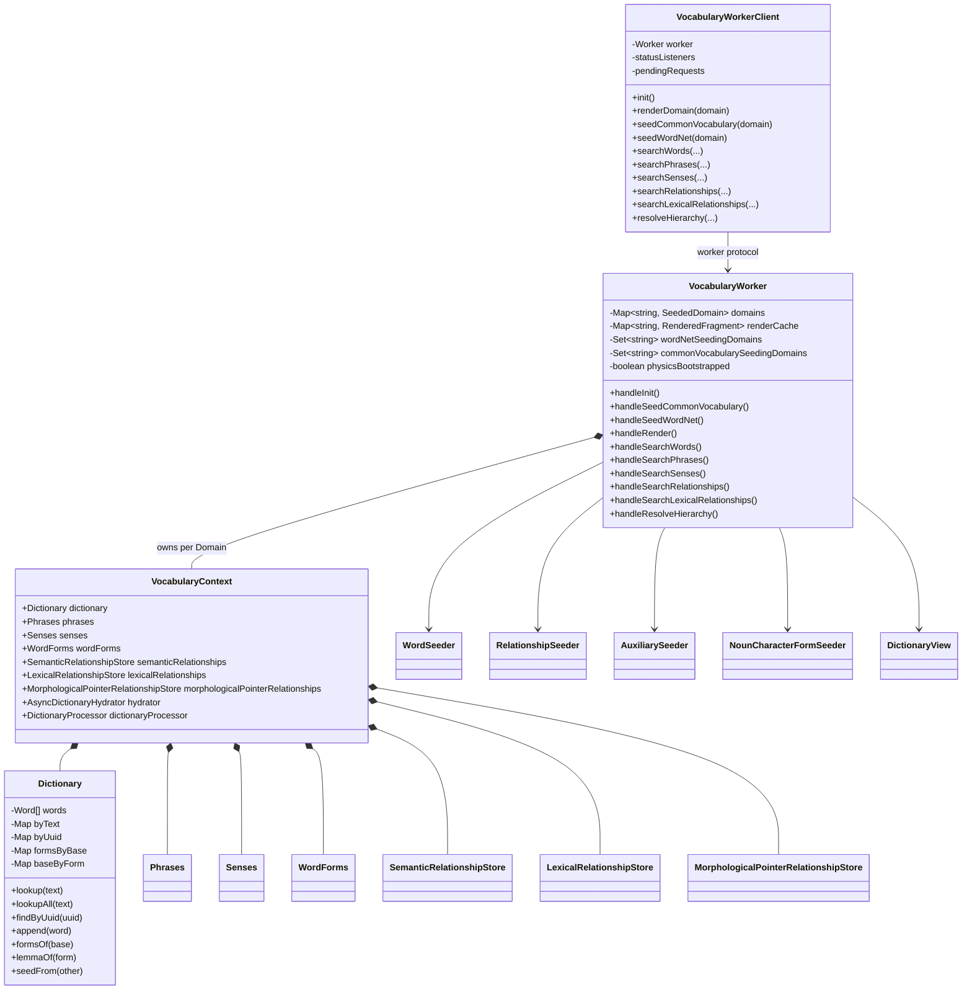
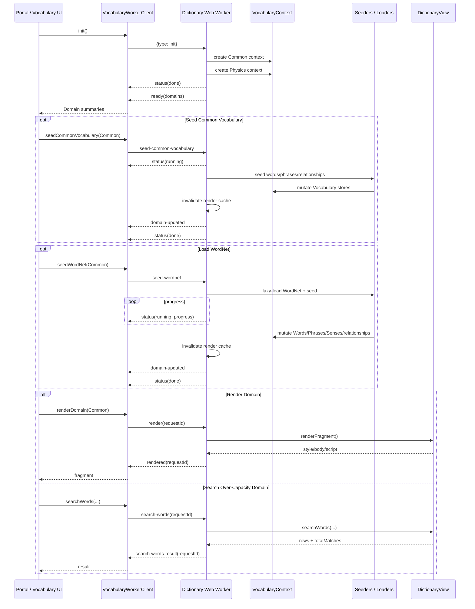
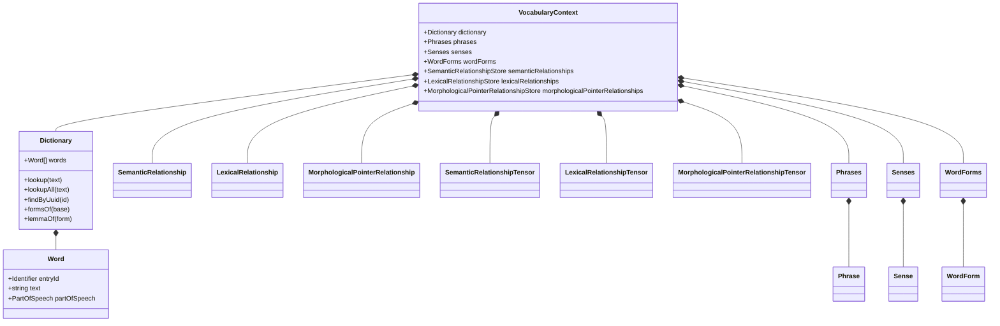

# Dictionary Web Worker Architecture

## Purpose and Scope

This document defines the architecture of the LIRA Vocabulary Dictionary Web Worker as implemented in the TypeScript prototype. It follows the same architecture-document structure used for the HTML Crawler & Document Processor and separates requirements, conceptual structure, worker/service design, information, deployment, and security views.

The architecture described here is grounded in the current prototype under `src/lira/vocabulary/`. The Vocabulary Service is hosted by `role/web_worker/vocabulary_worker.ts`, called through `VocabularyWorkerClient`, and uses `vocabulary_worker_protocol.ts` as its typed message boundary. The service owns one or more Vocabulary Domains, each represented at runtime by a `VocabularyContext` containing its Dictionary, Phrases, Senses, WordForms, semantic relationships, lexical relationships, temporary morphological-pointer relationship state, processors, tensors, and hydration support.

The term **Dictionary Web Worker** is used in this document for the Vocabulary Service worker because the worker is the runtime owner of the Dictionary-oriented Vocabulary Domain services presented to the rest of the prototype.

---

# 1. Requirements View

## 1.1 Functional Requirements

| Requirement ID | Requirement Statement | Requirement Rationale | Quantifiable | Value Min | Value Max |
|---|---|---|---|---:|---:|
| DWW-FR-001 | The Dictionary Web Worker shall run Vocabulary data loading, indexing, seeding, searching, hierarchy resolution and Dictionary View generation outside the main UI thread. | Large vocabulary operations must not block the Portal UI. | Yes | 1 worker | 1 worker per Vocabulary Service instance |
| DWW-FR-002 | The worker shall register addressable Vocabulary Domains during initialisation without requiring vocabulary data to be seeded at startup. | Domain identity must exist before optional data-loading operations, while startup cost remains low. | Yes | 1 domain | Implementation-defined |
| DWW-FR-003 | The current prototype shall register at least the Common and Physics Domains during worker initialisation. | These Domains are the presently implemented Vocabulary contexts. | Yes | 2 domains | 2 current prototype domains |
| DWW-FR-004 | Each registered Domain shall own an independent `VocabularyContext`. | Mutable lexical state must not be shared accidentally between Domains. | Yes | 1 context/domain | 1 context/domain |
| DWW-FR-005 | The worker shall support on-demand seeding of the Common Vocabulary Cache into a selected Domain. | Closed-class and metalinguistic vocabulary must be loadable without being mandatory at application startup. | Yes | 0 runs/session | Unbounded, subject to idempotency guards |
| DWW-FR-006 | The worker shall support on-demand loading of Princeton WordNet into a selected Domain. | General-English open-class vocabulary and semantic relationships require a scalable external lexical source. | Yes | 0 runs/session | Unbounded, with one active run/domain |
| DWW-FR-007 | The worker shall prevent concurrent duplicate Common Vocabulary seeding against the same Domain. | Overlapping mutation of the same Domain could duplicate data or create inconsistent indexing. | Yes | 0 overlapping runs | 1 active run/domain |
| DWW-FR-008 | The worker shall prevent concurrent duplicate WordNet seeding against the same Domain. | WordNet loading is large and mutating; concurrent runs against one Domain would be unsafe and wasteful. | Yes | 0 overlapping runs | 1 active run/domain |
| DWW-FR-009 | The worker shall support one-time inheritance of Common vocabulary into child Domains using Domain-local copies rather than shared mutable Word instances. | Child Domains need Common lexical content while preserving independent runtime identity and mutability. | Yes | 0 copies before bootstrap | 1 bootstrap copy per child/domain lifecycle |
| DWW-FR-010 | The worker shall preserve stable qualified lexical identity when copying Common words into another Domain while assigning fresh per-Domain graph UUIDs. | Stable source identity and runtime graph identity serve different purposes and must not be conflated. | Yes | 1 stable identity | 1 fresh graph UUID per copied Word |
| DWW-FR-011 | The Dictionary shall support case-insensitive text lookup. | Vocabulary identification must resolve orthographic case variants consistently. | Yes | 1 lookup result | All homographs retrievable |
| DWW-FR-012 | The Dictionary shall support retrieval of all homographic Word entries sharing the same surface text. | A surface form may have multiple POS or sense-specific Word entries. | Yes | 0 matches | Unbounded by model |
| DWW-FR-013 | The Dictionary shall support O(1)-class lookup by graph UUID. | Detail navigation and relationship pivot operations must avoid whole-dictionary scans. | Yes | 1 lookup | 1 result/UUID |
| DWW-FR-014 | The Dictionary shall maintain direct lemma-to-form and form-to-lemma indexes. | Inflection navigation must not require scans over relationship stores. | Yes | 0 links | Unbounded by lexical model |
| DWW-FR-015 | The worker shall expose Domain summaries containing Domain name, optional parent Domain, Word count, and semantic relationship count. | The Portal requires a lightweight representation of Vocabulary Domain state. | Yes | 1 summary/domain | 1 summary/domain |
| DWW-FR-016 | The worker shall publish status messages during long-running work. | Users and calling services require visibility of service state. | Yes | 1 terminal status | Multiple progress statuses + terminal status |
| DWW-FR-017 | WordNet loading shall publish progress where the total number of synsets is known. | Large seed operations need measurable progress rather than an indeterminate wait. | Yes | 0.0 | 1.0 |
| DWW-FR-018 | The worker shall invalidate a Domain's cached rendered Dictionary View after Vocabulary data changes. | Rendered UI fragments must not represent stale lexical state. | Yes | 1 invalidation/mutation batch | 1 invalidation/mutation batch |
| DWW-FR-019 | The worker shall render a Dictionary View for a selected Domain on request. | The Vocabulary UI needs a complete server/worker-side representation of the selected Domain. | Yes | 0 renders | Unbounded |
| DWW-FR-020 | The worker shall cache rendered Dictionary View fragments per Domain until that Domain mutates. | Re-rendering unchanged large vocabularies is unnecessarily expensive. | Yes | 0 cached fragments | 1 current fragment/domain |
| DWW-FR-021 | The worker shall return render failures against the request ID that initiated the render. | A failed render must reject the correct client promise rather than leave it unresolved. | Yes | 1 response/request | 1 response/request |
| DWW-FR-022 | The worker shall support server-side/worker-side Word search when the full Dictionary is too large to embed in a rendered fragment. | Large WordNet-backed vocabularies exceed practical client-side embedded-array limits. | Yes | 0 results | Request limit |
| DWW-FR-023 | The worker shall support server-side/worker-side Phrase search. | Phrases are a separate lexical category and require independent search. | Yes | 0 results | Request limit |
| DWW-FR-024 | The worker shall support server-side/worker-side Sense search. | Sense-level lexical meaning must be independently discoverable. | Yes | 0 results | Request limit |
| DWW-FR-025 | The worker shall support Semantic Relationship search. | Queryable sense-to-sense semantic structure is a permanent Vocabulary concern. | Yes | 0 results | Request limit |
| DWW-FR-026 | The worker shall support Lexical Relationship search. | WordForm+Sense-to-WordForm+Sense lexical structure is a permanent queryable Vocabulary concern. | Yes | 0 results | Request limit |
| DWW-FR-027 | The worker shall support hierarchy resolution over Vocabulary relationships. | Hypernym/hyponym and other hierarchical structures must be explorable without client-side full-store embedding. | Yes | 0 nodes | Request limit / implementation capacity |
| DWW-FR-028 | Search responses shall return both the capped result set and the uncapped total match count. | The UI must distinguish “number shown” from “number matched.” | Yes | 0 matches | Full store count |
| DWW-FR-029 | Unknown Domain search requests shall return an empty result rather than leave a request unresolved. | Protocol calls require deterministic completion. | Yes | 1 response | 1 response |
| DWW-FR-030 | Natural Vocabulary data shall remain in Vocabulary data/model classes and processors; the Web Worker shall act as host/orchestrator rather than redefining those models. | Worker plumbing must not duplicate domain semantics. | No | N/A | N/A |

## 1.2 Non-Functional Requirements

The non-functional requirements are organised using SQUARE-style quality categories. SQUARE is used here as a requirements-engineering alignment mechanism: requirements are explicit, prioritised by architectural significance, measurable where practical, and traced to service responsibilities.

### 1.2.1 Performance and Efficiency

| Requirement ID | Requirement Statement | Requirement Rationale | Quantifiable | Value Min | Value Max |
|---|---|---|---|---:|---:|
| DWW-NFR-PERF-001 | Vocabulary loading, search, hierarchy building and view generation shall execute off the main browser thread. | The user interface must remain responsive during large Dictionary operations. | Yes | 100% designated heavy operations off-main-thread | 100% |
| DWW-NFR-PERF-002 | Text lookup and UUID lookup shall use indexed access rather than full Dictionary scans. | Repeated linear scans become quadratic at interactive scale. | Yes | O(1)-class map lookup | O(1)-class expected |
| DWW-NFR-PERF-003 | Lemma/form navigation shall use explicit indexes rather than relationship-store scans. | Morphological lookup is frequent and should not depend on graph traversal. | Yes | O(1)-class index lookup | O(1)-class expected |
| DWW-NFR-PERF-004 | WordNet assets shall be loaded lazily rather than included in the always-loaded Vocabulary worker bundle. | The large WordNet payload should be paid only by sessions that use it. | Yes | 0 WordNet bytes loaded before request | Full WordNet assets after request |
| DWW-NFR-PERF-005 | Rendered Dictionary fragments shall be cached until the owning Domain changes. | Large render generation is avoidable for unchanged data. | Yes | 0 duplicate renders for cache hit | 1 render per state version/domain |
| DWW-NFR-PERF-006 | Search requests shall support result limits. | Large result sets must not generate uncontrolled structured-clone and rendering cost. | Yes | 1 result where requested | Caller-defined / implementation cap |

### 1.2.2 Scalability

| Requirement ID | Requirement Statement | Requirement Rationale | Quantifiable | Value Min | Value Max |
|---|---|---|---|---:|---:|
| DWW-NFR-SCAL-001 | The architecture shall support Dictionaries ranging from the Common Vocabulary Cache scale to WordNet-scale lexical inventories without changing the worker protocol. | The same service boundary should support small and large Domains. | Yes | ~thousands of Words | ~hundreds of thousands of Words in current design target |
| DWW-NFR-SCAL-002 | Search and hierarchy operations shall continue to function when client-side embedded arrays are disabled due to capacity thresholds. | Large Domains must not lose functionality merely because direct UI embedding becomes impractical. | Yes | 1 supported over-capacity Domain | Multiple Domains |
| DWW-NFR-SCAL-003 | Vocabulary Domains shall remain logically independent so additional Domains can be added without changing Dictionary internals. | Domain growth is a core LIRA architectural requirement. | Yes | 1 Domain | Memory-bound |

### 1.2.3 Reliability and Availability

| Requirement ID | Requirement Statement | Requirement Rationale | Quantifiable | Value Min | Value Max |
|---|---|---|---|---:|---:|
| DWW-NFR-REL-001 | Every request carrying a request ID shall result in either a matching success result or matching error result. | Client promises must not hang indefinitely. | Yes | 1 terminal response/request | 1 terminal response/request |
| DWW-NFR-REL-002 | A seeding failure shall not silently report successful Domain state. | Data integrity is more important than hiding loader errors. | Yes | 1 error status on failure | 1 error status + error message |
| DWW-NFR-REL-003 | Duplicate in-flight seeding of the same source into the same Domain shall be prevented. | Concurrent mutation creates integrity and duplication risk. | Yes | 0 concurrent duplicates | 1 active operation/source/domain |
| DWW-NFR-REL-004 | Cached views shall be invalidated whenever the underlying Domain's visible state changes. | Cached output must be consistent with data. | Yes | 100% mutation batches invalidate | 100% |
| DWW-NFR-REL-005 | Domain inheritance shall copy Word instances rather than share them. | A child mutation must not corrupt Common or another Domain. | Yes | 0 shared mutable Words across Domain copies | 0 |

### 1.2.4 Maintainability and Modifiability

| Requirement ID | Requirement Statement | Requirement Rationale | Quantifiable | Value Min | Value Max |
|---|---|---|---|---:|---:|
| DWW-NFR-MAINT-001 | Worker request and response types shall be declared in a dedicated protocol module shared by client and worker. | Both sides must compile against the same contract. | Yes | 1 protocol module/service | 1 |
| DWW-NFR-MAINT-002 | Main-thread worker access shall be encapsulated by `VocabularyWorkerClient`. | UI components should not implement raw worker-message plumbing. | Yes | 1 client abstraction | 1/service instance |
| DWW-NFR-MAINT-003 | Domain model classes shall not import Knowledge-layer UI/service state solely to satisfy the worker protocol. | Layering must remain Vocabulary-owned. | Yes | 0 Knowledge dependencies in Vocabulary protocol | 0 |
| DWW-NFR-MAINT-004 | Permanent queryable relationship stores shall remain distinct from seeding-only intermediate morphological-pointer state. | Temporary loader mechanics must not leak into the stable domain model. | Yes | 2 permanent relationship stores + temporary working store | As designed |
| DWW-NFR-MAINT-005 | New search operations shall use typed request/result pairs and request correlation rather than ad-hoc message payloads. | Protocol evolution must remain predictable and testable. | Yes | 1 typed pair/operation | N/A |

### 1.2.5 Interoperability

| Requirement ID | Requirement Statement | Requirement Rationale | Quantifiable | Value Min | Value Max |
|---|---|---|---|---:|---:|
| DWW-NFR-INT-001 | Worker messages shall contain structured-clone-safe data only. | Browser Web Worker boundaries cannot transfer live class instances safely as shared runtime objects. | Yes | 100% protocol payloads clone-safe | 100% |
| DWW-NFR-INT-002 | External lexical sources such as WordNet shall be transformed into LIRA Vocabulary classes rather than exposed directly to consumers. | LIRA requires one internal lexical model independent of source format. | Yes | 1 internal model | 1 |
| DWW-NFR-INT-003 | Domain summaries shall remain Vocabulary-owned transport types rather than Knowledge-layer UI entities. | Inter-layer communication must not reverse dependency direction. | Yes | 0 direct Knowledge type imports | 0 |

### 1.2.6 Portability

| Requirement ID | Requirement Statement | Requirement Rationale | Quantifiable | Value Min | Value Max |
|---|---|---|---|---:|---:|
| DWW-NFR-PORT-001 | Vocabulary core data and processing logic shall remain independent of the DOM. | The same Vocabulary service logic should be portable from browser workers to future server/service runtimes. | Yes | 0 DOM dependencies in Dictionary core | 0 |
| DWW-NFR-PORT-002 | The browser worker shall be treated as a deployment host for the Vocabulary Service, not as the definition of the Vocabulary model itself. | LIRA may later host the same service outside a browser tab. | No | N/A | N/A |

### 1.2.7 Observability

| Requirement ID | Requirement Statement | Requirement Rationale | Quantifiable | Value Min | Value Max |
|---|---|---|---|---:|---:|
| DWW-NFR-OBS-001 | The worker shall publish explicit service states: idle/running/done/error as defined by the Vocabulary protocol. | Calling layers require a stable operational state model. | Yes | 4 states | 4 states |
| DWW-NFR-OBS-002 | Long-running WordNet operations shall publish progress values in the closed interval [0,1] when totals are known. | Progress indicators need a machine-readable fraction. | Yes | 0 | 1 |
| DWW-NFR-OBS-003 | Completed seed operations shall publish updated Domain summaries. | Observers need refreshed counts without reinitialising the service. | Yes | 1 update/changed Domain | 1/update event |

### 1.2.8 Security

| Requirement ID | Requirement Statement | Requirement Rationale | Quantifiable | Value Min | Value Max |
|---|---|---|---|---:|---:|
| DWW-NFR-SEC-001 | Only recognised protocol message types shall invoke worker operations. | Unstructured commands increase attack and integrity risk. | Yes | 100% handled commands typed/recognised | 100% |
| DWW-NFR-SEC-002 | Domain names supplied by callers shall be resolved against the worker-owned Domain registry before mutation or query. | Callers must not create arbitrary hidden state through malformed requests. | Yes | 100% domain-targeted requests validated | 100% |
| DWW-NFR-SEC-003 | External lexical assets shall be parsed as data and shall not be executed as code. | Vocabulary sources are untrusted input from the perspective of model integrity. | Yes | 0 source-data code execution | 0 |
| DWW-NFR-SEC-004 | Rendered fragments crossing from the Vocabulary worker to the Portal shall be treated as an explicit trust boundary. | The fragment contains HTML/CSS/script text and therefore has greater execution impact than ordinary lexical records. | Yes | 1 controlled mounting path | 1 |
| DWW-NFR-SEC-005 | Future server-side or privileged deployment shall add source authenticity, size limits, resource quotas and input-validation controls before accepting arbitrary external dictionaries. | Browser prototype assumptions are insufficient for a privileged service. | No | N/A | N/A |

---

# 2. Conceptual Architecture View

## 2.1 Picture in Words

The Dictionary Web Worker is the runtime boundary around the Vocabulary Layer's lexical state.

At startup, the main thread creates a `VocabularyWorkerClient`. The client creates a module Web Worker running `vocabulary_worker.ts`. The worker creates no UI DOM and initially registers only empty Domain shells. In the current prototype those shells are `Common` and `Physics`.

Each Domain owns one `VocabularyContext`. The context is the aggregation point for all Vocabulary state belonging to that Domain:

```text
Vocabulary Domain
    |
    +-- VocabularyContext
          |
          +-- Dictionary
          +-- Phrases
          +-- Senses
          +-- WordForms
          |
          +-- SemanticRelationshipStore
          +-- SemanticRelationshipTensor
          +-- SemanticRelationshipProcessor
          |
          +-- LexicalRelationshipStore
          +-- LexicalRelationshipTensor
          +-- LexicalRelationshipProcessor
          |
          +-- MorphologicalPointerRelationshipStore   [seeding working state]
          +-- MorphologicalPointerRelationshipTensor  [seeding working state]
          +-- MorphologicalPointerRelationshipProcessor
          |
          +-- AsyncDictionaryHydrator
          +-- DictionaryProcessor
```

The worker does not force lexical data to load during service initialisation. Instead, lexical sources are explicit operations:

```text
                 VocabularyWorkerClient
                          |
                          v
                Dictionary Web Worker
                          |
            +-------------+-------------+
            |                           |
            v                           v
 Common Vocabulary Cache          Princeton WordNet
            |                           |
            +-------------+-------------+
                          |
                          v
                    WordSeeder
                          |
          +---------------+----------------+
          |               |                |
          v               v                v
      Dictionary       Phrases          Senses
          |               |                |
          +---------------+----------------+
                          |
                    Relationship Seeders
                          |
           +--------------+---------------+
           |                              |
           v                              v
 Semantic Relationships          Lexical Relationships
           |                              |
           +--------------+---------------+
                          |
                          v
                   VocabularyContext
```

The Dictionary itself is the lexical inventory. It stores Words and provides indexed lookup by text and UUID. It additionally stores lemma/form indexes so inflectional navigation does not need to scan relationship stores.

`Phrases` is the multi-word lexical counterpart to Dictionary. `Senses` holds meaning objects. `WordForms` holds addressable inflected forms. Semantic and Lexical Relationship stores are permanent queryable model state. The Morphological Pointer Relationship store is different: it is intermediate seeding state used to build the permanent structures and morphological attributes.

The worker also acts as a query and rendering service. Small Domains can be rendered with embedded data, while large Domains can be searched through request/response messages without copying the full Vocabulary graph into the main thread.

## 2.2 Conceptual Service Context

```text
+-----------------------------+
| Main Browser Thread         |
|                             |
| Portal / Vocabulary UI      |
| VocabularyWorkerClient      |
+--------------+--------------+
               |
               | postMessage / structured clone
               v
+----------------------------------------------+
| Dictionary Web Worker                        |
| vocabulary_worker.ts                         |
|                                              |
| Domain Registry                              |
|  + Common -> VocabularyContext               |
|  + Physics -> VocabularyContext              |
|                                              |
| WordSeeder / RelationshipSeeder              |
| DictionaryView                               |
| Search / Hierarchy handlers                  |
| Render cache                                 |
+----------+----------------------+------------+
           |                      |
           | bundled/lazy data    | results
           v                      v
+--------------------+     +--------------------+
| Common Vocabulary  |     | Typed Worker       |
| Cache assets       |     | Responses          |
+--------------------+     +--------------------+
           |
           | lazy WordNet import when requested
           v
+--------------------+
| Princeton WordNet  |
| lexical assets     |
+--------------------+
```

---

# 3. Web Worker Service Breakdown View

## 3.1 UML Class Diagram



## 3.2 Role Classes, Purpose and Requirement Traceability

| Role / Class | Purpose | Primary Requirements |
|---|---|---|
| `VocabularyWorkerClient` | Main-thread façade for the Vocabulary Service. Creates the worker, correlates requests/results, exposes status and operation methods to the Portal/UI. | DWW-FR-001, DWW-FR-016, DWW-FR-021, DWW-NFR-MAINT-001, DWW-NFR-MAINT-002 |
| `vocabulary_worker.ts` | Worker entry point and service orchestrator. Owns Domain registry, seeding lifecycle, render cache, search handlers, hierarchy resolution and message dispatch. | DWW-FR-002–009, DWW-FR-015–029 |
| `vocabulary_worker_protocol.ts` | Shared typed request/response contract across the worker boundary. | DWW-NFR-MAINT-001, DWW-NFR-INT-001, DWW-NFR-SEC-001 |
| `VocabularyContext` | Per-Domain aggregate containing lexical stores, processors, relationship tensors and hydration services. | DWW-FR-004, DWW-FR-030, DWW-NFR-MAINT-004 |
| `Dictionary` | Word inventory with indexed text/UUID lookup and lemma/form indexes. | DWW-FR-011–014, DWW-NFR-PERF-002, DWW-NFR-PERF-003 |
| `Phrases` | Multi-word lexical inventory separate from single-Word Dictionary entries. | DWW-FR-023, DWW-NFR-SCAL-001 |
| `Senses` | Permanent store of lexical/semantic meanings shared by WordNet synset members and other Vocabulary entries. | DWW-FR-024–026 |
| `WordForms` | Addressable inflected spelling/form inventory associated with Words and Senses. | DWW-FR-014, DWW-NFR-MAINT-004 |
| `SemanticRelationshipStore` | Permanent sense-to-sense semantic relationship model. | DWW-FR-025, DWW-FR-027 |
| `LexicalRelationshipStore` | Permanent WordForm+Sense lexical relationship model. | DWW-FR-026, DWW-FR-027 |
| `MorphologicalPointerRelationshipStore` | Temporary seeding working graph used to derive permanent semantic/lexical structures and morphological properties. | DWW-NFR-MAINT-004 |
| `WordSeeder` | Loads Common Vocabulary and WordNet lexical entries into LIRA data stores. | DWW-FR-005, DWW-FR-006, DWW-FR-017 |
| `RelationshipSeeder` | Converts cached relationship specifications into LIRA relationship structures. | DWW-FR-005, DWW-FR-025, DWW-FR-026 |
| `AuxiliarySeeder` | Ensures auxiliary senses such as be/have/do are established in the required seed order. | DWW-FR-005, DWW-NFR-REL-002 |
| `NounCharacterFormSeeder` | Adds character-form classification to relevant WordNet-seeded punctuation Nouns. | DWW-FR-006 |
| `DictionaryView` | Worker-side Dictionary rendering, server-style search, relationship search and hierarchy construction. | DWW-FR-019–029, DWW-NFR-SCAL-002 |
| Render Cache | Holds the current rendered fragment for each unchanged Domain. | DWW-FR-018, DWW-FR-020, DWW-NFR-PERF-005 |

---

# 4. Information View

## 4.1 Web Worker Protocol

The Web Worker protocol is the only supported runtime boundary between the main-thread client and the Vocabulary Service. Requests and responses are plain structured-clone-safe data. The actual `Dictionary`, `VocabularyContext`, Words, relationship stores and processors remain worker-owned.

### 4.1.1 Request Types

| Request Type | Purpose | Correlated by Request ID |
|---|---|---|
| `init` | Register empty Vocabulary Domains and return summaries. | No |
| `seed-common-vocabulary` | Seed Common Vocabulary Cache and relationships into a Domain. | No; lifecycle reported by status/domain updates |
| `seed-wordnet` | Seed Princeton WordNet into a Domain. | No; lifecycle reported by status/domain updates |
| `render` | Render a Domain's Dictionary View fragment. | Yes |
| `search-words` | Search Word records in the worker-owned Dictionary. | Yes |
| `search-phrases` | Search Phrase records. | Yes |
| `search-senses` | Search Sense records. | Yes |
| `search-relationships` | Search Semantic Relationship records. | Yes |
| `search-lexical-relationships` | Search Lexical Relationship records. | Yes |
| `resolve-hierarchy` | Build a bounded hierarchy view for a relationship kind or selected Word. | Yes |

### 4.1.2 Response Types

| Message Type | Purpose |
|---|---|
| `status` | Service operation state; may include progress. |
| `ready` | Initial Domain registration complete. |
| `domain-updated` | A Domain's counts changed following a seed operation. |
| `rendered` | Successful Dictionary View fragment result. |
| `render-error` | Render-specific failure correlated to the initiating request. |
| `search-words-result` | Capped Word records plus uncapped total match count. |
| `search-phrases-result` | Capped Phrase records plus uncapped total match count. |
| `search-senses-result` | Capped Sense records plus uncapped total match count. |
| `search-relationships-result` | Capped Semantic Relationship records plus uncapped total match count. |
| `search-lexical-relationships-result` | Capped Lexical Relationship records plus uncapped total match count. |
| `resolve-hierarchy-result` | Hierarchy nodes, edges, roots, totals and truncation/fallback indicators. |
| `error` | General Vocabulary Service failure. |

### 4.1.3 Information Flow Diagram



## 4.2 Data Model

### 4.2.1 Data Model Diagram



### 4.2.2 Data Classes and Purpose

| Data Class / Store | Purpose |
|---|---|
| `VocabularyContext` | Per-Domain container aggregating Vocabulary stores, processors, tensors and hydration services. |
| `Dictionary` | Single-Word lexical inventory and its runtime indexes. |
| `Word` and POS-specialised Word entities | Represent one lexical form in one language and grammatical category, with identity and POS-specific attributes. |
| `Phrases` | Repository for multi-word lexical units that are independent vocabulary entries. |
| Phrase classes | Represent typed lexical phrases such as noun, verb, adjective, adverb, prepositional and infinitive phrases. |
| `Senses` | Repository for meaning entities and Word/Phrase membership of those meanings. |
| `Sense` | Addressable meaning record, including definition/gloss-related lexical-semantic information. |
| `WordForms` | Repository for addressable inflected WordForm records. |
| `WordForm` | One specific inflected/orthographic form associated with Word and Sense context. |
| `SemanticRelationshipStore` | Permanent queryable store of sense-to-sense semantic relationships. |
| `SemanticRelationship` | Directional semantic relationship between source and destination senses/roles. |
| `SemanticRelationshipSystemPropertyTensor` | Tensor-backed system properties associated with semantic relationships. |
| `LexicalRelationshipStore` | Permanent queryable store of WordForm+Sense lexical relationships. |
| `LexicalRelationship` | Directional lexical relationship where a destination form/sense modifies or relates to a source form/sense. |
| `LexicalRelationshipSystemPropertyTensor` | Tensor-backed system properties associated with lexical relationships. |
| `MorphologicalPointerRelationshipStore` | Intermediate loader/seeding relationship structure used to transform source lexical pointers into permanent LIRA structures. |
| `MorphologicalPointerRelationshipSystemPropertyTensor` | Tensor-backed properties for the temporary morphological-pointer graph. |
| `DefinitionWordReference` | Reference from definition text to Vocabulary Words used to make definitions linguistically addressable. |
| `ExternalWordCandidate` | Candidate result from an external vocabulary source used during asynchronous hydration. |
| `AttributeValue` | Data structure for a Vocabulary attribute/value association where used by the model. |
| Enum classes | Stable classifications such as part of speech, relationship kind and other constrained Vocabulary values. |

### 4.2.3 Permanent vs Seeding-Only Information

A key information architecture distinction is:

```text
Permanent queryable Vocabulary state
    Dictionary
    Phrases
    Senses
    WordForms
    SemanticRelationshipStore
    LexicalRelationshipStore
    associated system-property tensors

Seeding / transformation working state
    MorphologicalPointerRelationshipStore
    MorphologicalPointerRelationshipTensor
    MorphologicalPointerRelationshipProcessor
```

The temporary morphological-pointer structure may be populated from WordNet or cached relationship sources because those source formats express relationships in a form useful during ingestion. Once the seeding pass has converted those pointers into LIRA's permanent semantic, lexical and POS-specific structures, consumers should query the permanent model rather than depending on loader-internal state.

---

# 5. Deployment View

## 5.1 Current Prototype Deployment

```text
Browser Tab / Vite Application
|
+-- Main Thread
|    |
|    +-- PortalShell
|    +-- ServiceStatusBoard
|    +-- VocabularyWorkerClient
|    +-- LinguisticsWorkerClient
|
+-- Vocabulary Module Web Worker
|    |
|    +-- vocabulary_worker.ts
|    +-- Domain registry
|    +-- VocabularyContext: Common
|    +-- VocabularyContext: Physics
|    +-- Common Vocabulary Cache assets
|    +-- DictionaryView
|    +-- WordSeeder / RelationshipSeeder
|    |
|    +-- [lazy on demand] Princeton WordNet assets
|
+-- Linguistics Module Web Worker
     |
     +-- independent Linguistics service state
```

The Vocabulary worker is created as a Vite module worker through `new Worker(new URL("./vocabulary_worker.ts", import.meta.url), { type: "module" })`.

The Common Vocabulary Cache is part of the Vocabulary worker's bundled dependency graph because it is a normal Vocabulary source. WordNet is deliberately lazy-loaded only after a `seed-wordnet` request because of its substantially larger payload.

## 5.2 Runtime Isolation

The Vocabulary Service has its own JavaScript global scope and memory. Its `VocabularyContext` instances are not directly accessible from the main thread or from the Linguistics worker. Information crosses worker boundaries only via messages.

This is intentional because the browser-worker prototype is modelling a future service-process boundary:

```text
Prototype
Main Thread <-> Vocabulary Web Worker

Future service equivalent
Portal/API <-> Vocabulary Service Process
```

The current worker therefore acts as a deployment stand-in for a separately hosted Vocabulary service rather than merely a UI optimisation.

## 5.3 Scaling Characteristics

The current architecture scales primarily by improving in-worker indexes, avoiding full data transfer, using lazy loading, and performing server-style searches within the worker.

A single worker owns all Domains in the current prototype. This preserves deterministic mutation order because JavaScript executes each worker's event loop serially between asynchronous yields. If future scale requires multiple Vocabulary service workers, Domain ownership should be explicitly partitioned rather than allowing multiple workers to mutate the same in-memory Domain independently.

A likely future model is:

```text
Vocabulary Service Router
       |
       +-- Vocabulary Worker / Process: Common
       +-- Vocabulary Worker / Process: Domain A
       +-- Vocabulary Worker / Process: Domain B
       +-- Vocabulary Worker / Process: Domain N
```

Such partitioning would require explicit persistence, synchronisation, Domain lifecycle and Common-inheritance contracts that are outside the current prototype.

## 5.4 Persistence

Current Vocabulary worker state is in-memory and tied to the worker/browser-session lifecycle. The architecture does not presently guarantee durable persistence of seeded Vocabulary state. A production deployment would require a persistence adapter below or beside `VocabularyContext`, with clear separation between stable lexical identity and runtime graph UUIDs.

## 5.5 Failure and Restart Behaviour

If the Vocabulary worker terminates, its in-memory Domains, render cache and loaded WordNet state are lost. The client must create a new worker and reinitialise/reseed or restore state from future persistence. This is acceptable for the prototype but should be treated as a deployment limitation rather than a model requirement.

---

# 6. Security View

## 6.1 Security Objectives

The Vocabulary Service must protect:

- lexical data integrity;
- Domain isolation;
- stable lexical identifiers;
- runtime graph identifiers;
- relationship integrity;
- worker availability and browser responsiveness;
- the main thread from oversized or malformed responses;
- users from unsafe rendered fragments;
- future persisted Vocabulary stores from malformed or hostile external lexical sources.

## 6.2 Trust Boundaries

```text
Trust Boundary A
Portal / Main Thread
        |
        | typed postMessage protocol
        v
Dictionary Web Worker

Trust Boundary B
Dictionary Web Worker
        |
        | bundled or imported lexical source data
        v
Common Vocabulary Cache / WordNet / future external sources

Trust Boundary C
Dictionary Web Worker
        |
        | RenderedFragment {style, body, script}
        v
Portal DOM mounting path
```

The worker boundary protects the UI thread from direct mutation of Vocabulary state, but it is not itself an authorisation system. Any code with access to the worker client can request the operations exposed by the protocol.

## 6.3 Threat and Control Matrix

| Threat | Impact | Current / Required Control |
|---|---|---|
| Duplicate seeding requests | Duplicate data, excess memory, inconsistent derived structures | Per-Domain in-flight seeding guards for Common and WordNet. |
| Unknown/malformed Domain target | Incorrect mutation/query routing | Resolve every named Domain against worker-owned registry; return deterministic errors/empty results. |
| Oversized WordNet load | Memory pressure / service unresponsiveness | Lazy load only on demand; progress reporting; future production quotas required. |
| Repeated expensive render | CPU/memory pressure | Per-Domain render cache and invalidation only on mutation. |
| Huge result transfer | Structured-clone and UI memory pressure | Search limits and worker-side filtering. |
| Shared mutable Words between Domains | Cross-Domain corruption | `Dictionary.seedFrom` copies Words and gives fresh graph UUIDs. |
| Identifier collision across Domain copies | Broken graph addressing | Fresh per-Domain UUID while retaining stable qualified identity value. |
| Malformed external lexical data | Corrupt Vocabulary state | Parse through explicit seed/load processors; future schema validation and authenticity controls required. |
| Executable content embedded in external dictionary data | Code execution | Lexical sources treated as data only; never evaluate source strings as code. |
| Unsafe DictionaryView script/body content | XSS / Portal compromise | Treat rendered fragments as privileged output; only worker-generated code should be mounted; future CSP/sanitisation strategy required. |
| Protocol confusion / forged payload shape | Incorrect operation dispatch | Discriminated typed message protocol; runtime validation recommended for production. |
| Worker crash during mutation | Partial in-memory state | Errors surfaced; current prototype may require worker restart/reseed; transactional persistence required in production. |
| Resource exhaustion by repeated search/hierarchy calls | Availability degradation | Bounded limits, indexed lookups and future throttling/rate control for privileged deployments. |

## 6.4 Security Principles

The Dictionary Web Worker should follow these principles:

1. **Worker ownership of mutable Domain state.** The main thread receives transport representations, not direct mutable Vocabulary objects.
2. **Explicit data-source transformation.** WordNet and Common Vocabulary inputs become LIRA Vocabulary classes through defined seeders/processors.
3. **No source-code execution from lexical input.** External lexical files are data.
4. **Domain validation before action.** A request never implicitly creates a new target Domain.
5. **Bounded output.** Large queries are executed in the worker and return limited result sets.
6. **Stable identity is not runtime identity.** Cross-Domain copies retain stable qualified identity but receive fresh runtime UUIDs.
7. **Permanent model separated from ingestion working state.** Loader structures must not become accidental public APIs.
8. **Rendered fragments are a higher-trust transport type.** They must be handled differently from plain lexical records because they contain executable script text.
9. **Production persistence must be transactional.** A future persistent Vocabulary Service should not expose partially committed seed states after process failure.
10. **External-source trust must be explicit.** A future service that accepts arbitrary dictionaries requires schema validation, content-size limits, authenticity/provenance recording and resource quotas.

## 6.5 Production Hardening Requirements

The browser prototype does not currently implement all controls that a network-accessible Vocabulary Service would require. Before privileged/server-side deployment, the architecture should add:

| Hardening Area | Required Capability |
|---|---|
| Authentication | Identify the caller/service requesting Vocabulary mutations. |
| Authorisation | Control which callers may seed, replace or create Domains. |
| Source provenance | Record source, version, checksum and import time for every external lexical dataset. |
| Input validation | Validate WordNet/JSON/cache schemas before mutation. |
| Resource quotas | Cap Domain size, import size, concurrent long-running operations and result size. |
| Persistence transactions | Stage large imports and commit atomically. |
| Rollback | Restore the previous valid Domain state after failed import. |
| Audit | Record mutation operations and source provenance. |
| CSP / render safety | Restrict or remove executable script crossing service boundaries in a production UI. |
| Runtime protocol validation | Validate message/request payloads in addition to TypeScript compile-time typing. |
| Monitoring | Collect seed duration, dictionary size, search latency, memory pressure and failure metrics. |

---

# 7. Requirements Traceability Summary

Although the requested architecture views end at Section 6, this traceability summary is included to make the document operational as a requirements artefact.

| Architecture Concern | Requirement IDs |
|---|---|
| Worker isolation | DWW-FR-001, DWW-NFR-PERF-001, DWW-NFR-PORT-002 |
| Domain lifecycle | DWW-FR-002–004, DWW-FR-015 |
| Common Vocabulary loading | DWW-FR-005, DWW-FR-007, DWW-FR-009–010 |
| WordNet loading | DWW-FR-006, DWW-FR-008, DWW-FR-017 |
| Dictionary indexing | DWW-FR-011–014, DWW-NFR-PERF-002–003 |
| Rendering | DWW-FR-018–021, DWW-NFR-PERF-005 |
| Search | DWW-FR-022–029, DWW-NFR-SCAL-002 |
| Typed worker protocol | DWW-NFR-MAINT-001–002, DWW-NFR-INT-001 |
| Permanent vs temporary relationship state | DWW-NFR-MAINT-004 |
| Status/progress | DWW-FR-016–017, DWW-NFR-OBS-001–003 |
| Domain isolation | DWW-FR-004, DWW-FR-009–010, DWW-NFR-REL-005 |
| Security/hardening | DWW-NFR-SEC-001–005 |

---

# 8. Current Implementation Boundary

This architecture document intentionally distinguishes the **current prototype** from capabilities that belong to a future production Vocabulary Service.

Currently implemented in the prototype:

- one Vocabulary Web Worker service instance;
- `VocabularyWorkerClient` main-thread façade;
- typed worker protocol;
- Common and Physics Domain registration;
- independent `VocabularyContext` instances;
- Common Vocabulary Cache seeding;
- on-demand WordNet seeding;
- seeding concurrency guards;
- one-time Common-to-Physics bootstrap copy;
- indexed Dictionary lookup;
- Phrase, Sense and WordForm stores;
- permanent semantic and lexical relationship stores;
- temporary morphological-pointer seeding state;
- Dictionary View rendering and caching;
- worker-side Word/Phrase/Sense/relationship search;
- hierarchy resolution;
- status, progress, ready and Domain-updated messages.

Not yet guaranteed by the prototype and therefore treated as future deployment requirements rather than current behaviour:

- durable Vocabulary persistence;
- transactional import/rollback;
- network authentication/authorisation;
- arbitrary external-source trust validation;
- server-side quotas and rate limiting;
- production telemetry and audit persistence;
- multi-process Domain partitioning;
- distributed Common-Domain propagation;
- production-grade CSP/sanitisation for rendered Dictionary fragments.

This boundary is deliberate: the architecture describes where the current implementation ends and where a production Dictionary Service would need additional controls, without representing future requirements as already implemented behaviour.
