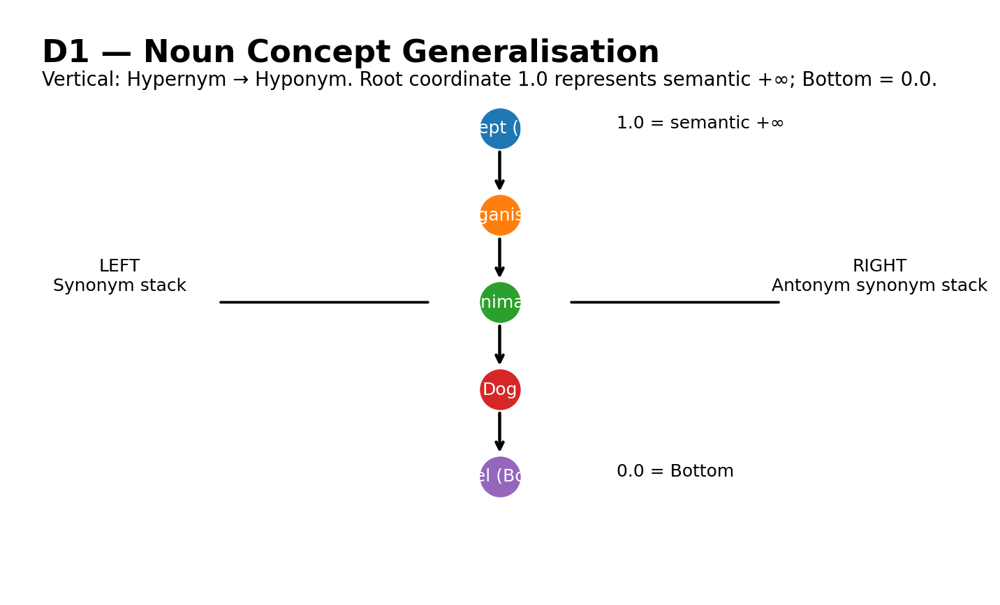
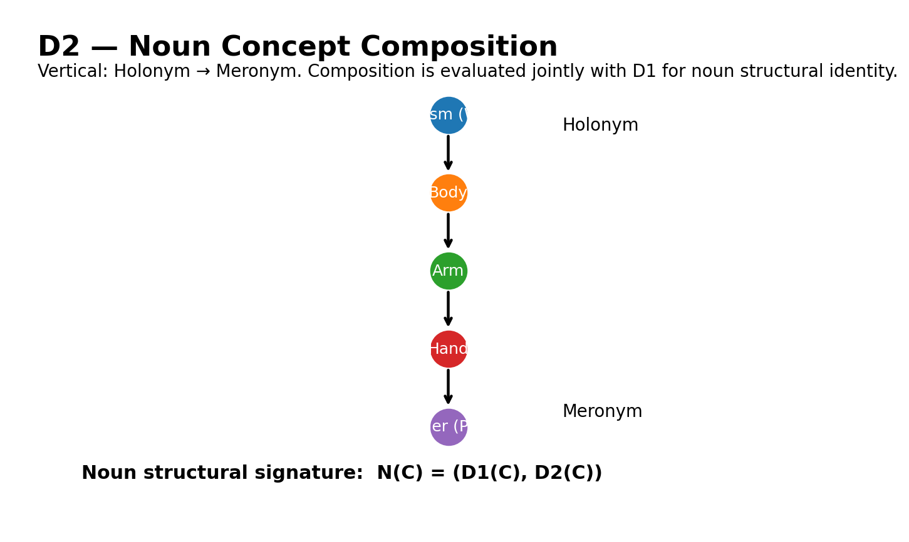
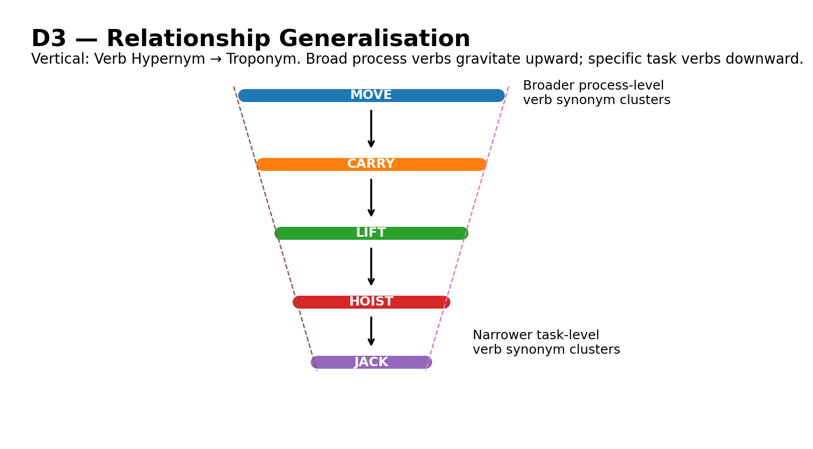
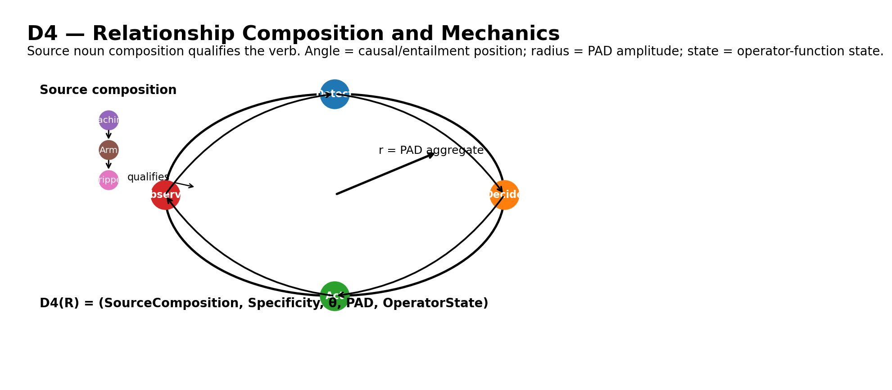
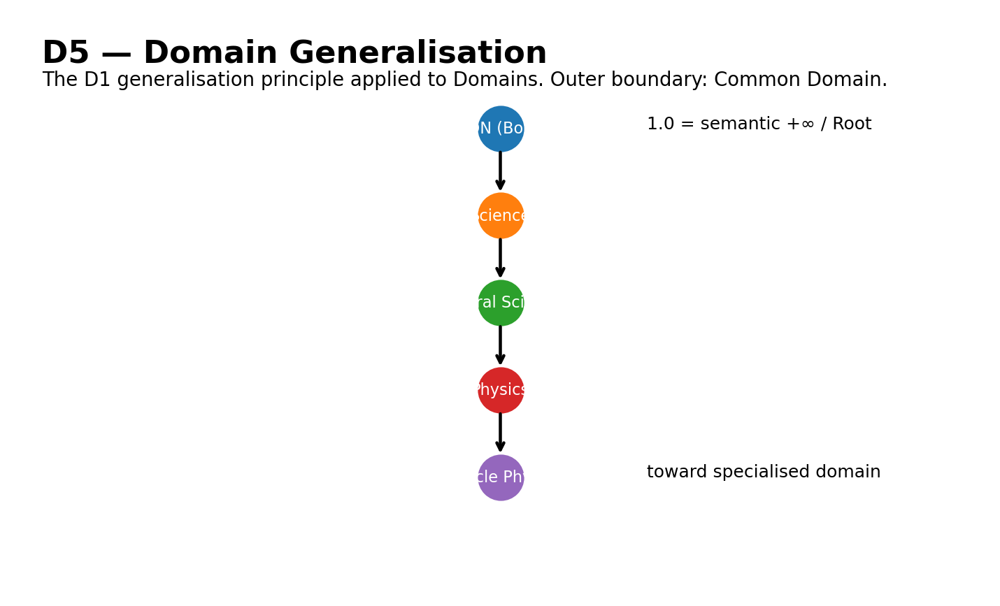
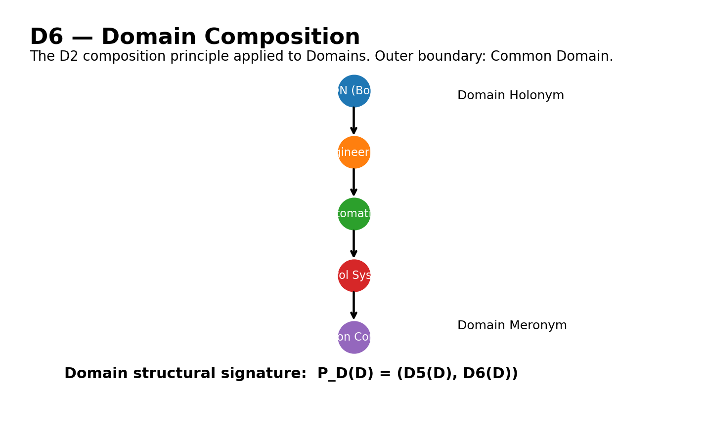

# LIRA Knowledge Vector Space Specification

**Semantic and Mathematical Definition**

Status: Working Architecture Specification (v2)
Scope: LIRA Knowledge Layer -- combined Concept, Relationship and Domain geometry

Revision note: Section 41 (Mathematical and Implementation Corrections)
refines the dimensional model set out in Sections 1-40 -- where it
conflicts with an earlier section (most notably D4's tuple definition in
Section 9 and the unqualified "D4 = 5-tuple" framing in Section 18),
Section 41 is authoritative.

## Implementation Status

| Piece | Status |
|---|---|
| D1 (Noun Concept Generalisation) | **Built** -- `TensorLiraGraph._concept_d1_z`, computed automatically inside `add_relationship`'s existing `isA_uuid` path (`knowledge/data/tensor_graph.py`) |
| D2 (Noun Concept Composition) | **Built** -- `TensorLiraGraph._concept_d2_z`, a new `partOf_uuid` path mirroring D1's, entirely independent tree |
| Fractional/gap indexing (41.9) | **Built** -- `TensorLiraGraph._position_below` |
| Noun structural identity + `ε_merge`/`ε_review` (12.1, 41.3) | **Built** -- `TensorLiraGraph.noun_structural_distance`/`classify_noun_identity`, configurable via the constructor |
| Worked example (D1/D2) | **Built** -- `examples/knowledge_vector_space_d1_d2.py` (the exact Concept/organism/animal/dog and vehicle/engine/wheel/chassis examples from Section 41.4, against a real graph, not hand-typed numbers) |
| D3 (Relationship/Verb Concept Generalisation) | **Built** -- `TensorLiraGraph._concept_d3_z`, reuses D1's own is-a bookkeeping, branching on the source Concept's `kind` (Section 41.5's part-of-speech scoping) |
| D4 (Relationship Composition and Mechanics) | **Built** -- `Qc`/`theta`/`r`/`s` (Section 41.1's 4-tuple) computed per edge instance, not stored per-Concept (`d4_source_composition`, `theta`, `d4_pad_amplitude`, `operator_state`, `d4`) |
| PAD authored on the Concept, read by D4 (41.2) | **Built** -- `TensorLiraGraph.set_pad`/`ConceptRef.pad`, `d4_pad_amplitude` = Euclidean magnitude of the *source* Concept's PAD |
| Causal/entailment angular positioning + closure check (9.2, 40.4) | **Built** -- `TensorLiraGraph.assign_causal_chain` |
| Polar-to-Cartesian derivation (9.4/41.4) | **Built** -- `TensorLiraGraph.d4_cartesian` |
| Relationship structural identity (12.2, 41.3) | **Built** -- `TensorLiraGraph.relationship_structural_distance`/`classify_relationship_identity` |
| Worked example (D3/D4) | **Built** -- `examples/knowledge_vector_space_d3_d4.py` (move/walk/stroll for D3; the spec's own Section 41.4 Birth/Live/Die/Resurrect closed causal chain for D4, verified to close: `Sum(Delta-theta) = 2*pi`) |
| Operator-function state enumeration (9.5) | Storage only (`set_operator_state`/`operator_state`, caller-defined value) -- the state enumeration/transition mechanics are explicitly out of this spec's own scope (9.5: "defined independently by the Relationship execution model") |
| D5 (Domain Generalisation) | **Built** -- `HostedDomains._domain_d5_z` (`knowledge/data/hosted_domains.py`), the Domain-scale mirror of D1, since D5/D6 are inherently cross-Domain (a single Domain's own `TensorLiraGraph` can't see other Domains) -- `register_domain_generalisation`, explicit like D1/D2/D3's own registration |
| D6 (Domain Composition) | **Built** -- `HostedDomains._domain_d6_z`, mirrors D2 the same way D5 mirrors D1 -- `register_domain_composition` |
| Common Domain as the D5/D6 outer boundary (4.1, 14, 15) | **Built** -- the "Common" Domain every `LIRAHost` already auto-creates (`host.py`) stays at `D1_D2_ROOT` permanently; `register_domain_generalisation`/`register_domain_composition` raise if asked to give Common a parent |
| Combined Domain structure + identity (15.1, 41.3) | **Built** -- `HostedDomains.domain_structural_position`/`domain_structural_distance`/`classify_domain_identity`, mirroring `noun_structural_*` |
| Worked example (D5/D6) | **Built** -- `examples/knowledge_vector_space_d5_d6.py` (the spec's own Section 5 Figure 5/6 example, Common -> Science -> NaturalScience -> Physics -> ParticlePhysics, against a real `LIRAHost`) |
| Domain Naming Convention <-> D5 segment mapping (41.6) | **Built** -- `HostedDomains.register_domain_hierarchy_from_name` parses a DNC-001 reverse-hierarchy dotted name (`python.programming.language.common`) and creates/D5-registers every missing intermediate Domain along the path automatically, idempotently |
| Synonym/Antonym Side/Sign geometry (10, 41.8) | **Built** -- `TensorLiraGraph.register_synonym`/`register_antonym`/`side`/`synonym_cluster`, a union-find over Concepts with antonym-derived Side/Sign propagated to and enforced across a whole merged cluster; raises on a genuine contradiction (registering as both synonym and antonym) rather than silently overwriting |
| NaN storage separation (41.7) | **Built** as a structural guarantee, not just documentation -- `_M_theta` (coordinate-row NaN, "unassigned") and Attribute values (`_concept_values`/`_cell_specific_value`) are different Python containers that physically cannot collide; `TensorLiraGraph.is_unassigned_theta` names the one legitimate NaN meaning this graph currently produces |
| Companion vector-space audit (41.10) | **Built** -- `TensorLiraGraph.vector_space_audit` (D1/D2-noun-only and D3-verb-only scope checks, causal-chain closure re-verification via a persisted chain log, coincident-Concept identity-evidence reporting, synonym-cluster consistency); `Intersections(D) = 0` is explicitly out of scope here -- a rendering-time layout property, not derivable from stored coordinates alone |
| `LexicalRelationshipType` mapping (41.11) | **Built** as the mapping table itself -- `knowledge/data/lexical_relationship_type_mapping.py`'s `vector_space_dimension_for`, matching the spec's own table exactly (including `HYPERNYM`'s dual D1/D3 mapping, resolved by part of speech) |
| Worked example (Phase 4) | **Built** -- `examples/knowledge_vector_space_phase4.py` covers all five pieces above against real graphs, including deliberately-broken cases (an open causal chain, a contradictory synonym/antonym registration, a Morphological-group kind with no mapping) to prove each check actually fires, not just the happy path |
| Vocabulary-to-Knowledge materialisation pipeline (41.11's "reinterpretation layer... rather than a requirement to replace the seeded semantic_relationships data model") | **Built** -- `knowledge/role/dictionary_seeder.py`'s `DictionarySeeder`, reading a Vocabulary Layer `Dictionary`/`LexicalRelationshipStore` read-only (Rule 17) and materialising every eligible `Word` as a Concept and every mapped `LexicalRelationship` as the corresponding D1/D2/D3/D4-theta edge or Synonym/Antonym Side-Sign registration, skipping reciprocal-pair kinds (`HYPONYM`/`HOLONYM`/`TROPONYM`) to avoid double-processing the same fact backwards |
| Worked example (Dictionary seeding) | **Built** -- `examples/knowledge_vector_space_dictionary_seeding.py`, seeding a real `TensorLiraGraph` from the Physics Domain's own fully hydrated Dictionary (3169 words, 6164 relationships), running the companion audit against the result, and spot-checking a real HYPERNYM D1 ordering, a real CAUSE/ENTAILMENT edge pair, and a real seeded PAD triple flowing through unchanged |
| Post-seeding Knowledge Vector Space passes | **Built** -- `knowledge/role/vector_space_passes.py`'s `run_vector_space_passes`: `close_open_causal_chains` walks the seeded CAUSE/ENTAILMENT edges as a directed graph and threads each connected run into a chain; a chain that doesn't already close gets a real `ConceptKind.Unknown` Concept instantiated "at the geometrically implied position" (spec 40.5's own phrase) via two structural closing edges, so `assign_causal_chain` closes and assigns theta to every edge by construction, not just by report -- spec 40.4/40.5 implemented for real, not just detected. Followed by a closing `vector_space_audit`. `DictionarySeeder` alone never calls `assign_causal_chain` (its own module docstring); this is the second pass that does, over real seeded data |
| Graphical Knowledge Vector Space UI | **Built** -- `knowledge/ui/knowledge_view.py`'s `KnowledgeView`: a single self-contained offline HTML page, meant to be generated only after a graph has been through *both* seeding and the vector space passes above (`examples/knowledge_view_example.py` makes that ordering explicit) -- SVG trees for D1/D2/D3/D5/D6 (positioned by each Concept/Domain's own z), an arrow diagram for D4 (every CAUSE/ENTAILMENT edge, plus every structural closing edge `close_open_causal_chains` inserted, drawn dashed and distinct, each with its own r and theta). D1/D2/D3 Concepts are grouped into one box per Domain (`DictionaryView.word_domain_labels()`), selectable via a Domain filter (All Domains, boxed, or one specific Domain); within a box, a dashed sub-box additionally groups any Concepts sharing a synonym cluster (`TensorLiraGraph.synonym_cluster`), toggleable off via a checkbox next to that Domain filter. Only a Concept this dimension has actually positioned is shown (an earlier revision showed every Concept of the relevant kind at a `z = -5.0` display-layer placeholder -- removed, since it made every Domain's box mostly noise on real data). A Concept node that traces back to a seeded Word is clickable straight through to that Word's own detail panel, rendered by a real embedded `DictionaryView` via a small additive hook (`window.liraDictionaryGoToWord`) `vocabulary/ui/dictionary_view.py`'s own script now exposes. Worked example: `examples/knowledge_view_example.py`, verified end to end with a headless-Chromium click-through (Domain filter narrowing, synonym-cluster box toggle, zero unassigned D4 theta, node-to-word navigation) |

| Core model |
|---|
| `K = (D1, D2, D3, D4, D5, D6)` |
| `D1 + D2 = Noun Structure` |
| `D3 + D4 = Relationship Structure and Mechanics` |
| `D5 + D6 = Domain Structure` |

## Contents

1. [Purpose and Scope](#1-purpose-and-scope)
2. [Dimension Summary](#2-dimension-summary)
3. [Fundamental Semantic Objects](#3-fundamental-semantic-objects)
4. [Domain Boundaries and Common](#4-domain-boundaries-and-common)
5. [Hierarchical Coordinate System](#5-hierarchical-coordinate-system)
6. [Dimension 1 -- Noun Concept Generalisation](#6-dimension-1--noun-concept-generalisation)
7. [Dimension 2 -- Noun Concept Composition](#7-dimension-2--noun-concept-composition)
8. [Dimension 3 -- Relationship Generalisation](#8-dimension-3--relationship-generalisation)
9. [Dimension 4 -- Relationship Composition and Mechanics](#9-dimension-4--relationship-composition-and-mechanics)
10. [Synonym and Antonym Geometry](#10-synonym-and-antonym-geometry)
11. [Domain-Global Layout Rules](#11-domain-global-layout-rules)
12. [Concept and Cluster Identity](#12-concept-and-cluster-identity)
13. [Euclidean Semantic Distance](#13-euclidean-semantic-distance)
14. [Dimension 5 -- Domain Generalisation](#14-dimension-5--domain-generalisation)
15. [Dimension 6 -- Domain Composition](#15-dimension-6--domain-composition)
16. [Nested Knowledge Geometry](#16-nested-knowledge-geometry)
17. [Completeness Rules](#17-completeness-rules)
18. [Consolidated Mathematical Model](#18-consolidated-mathematical-model)
19. [Semantic Interpretation](#19-semantic-interpretation)
20. [Core Principle](#20-core-principle)
40. [Runtime Evolution, Seeded Mechanics, and Open-Chain Recovery](#40-runtime-evolution-seeded-mechanics-and-open-chain-recovery)
41. [Mathematical and Implementation Corrections](#41-mathematical-and-implementation-corrections)

## 1. Purpose and Scope

The LIRA Knowledge Vector Space is a domain-bounded, multidimensional semantic
and mechanical representation of knowledge within the LIRA Knowledge Layer. It
is intended to make semantic structure, relationship mechanics, similarity,
identity evidence, and completeness directly derivable from a tensor
representation rather than maintained as unrelated metadata.

- Noun Concept structure.
- Verb Concept / Relationship structure.
- Relationship execution mechanics.
- Domain structure.
- Semantic similarity and identity evidence.
- Structural, causal and layout completeness.

```
K = (D1, D2, D3, D4, D5, D6)
(D1, D2) = Noun Structure
(D3, D4) = Relationship Structure and Mechanics
(D5, D6) = Domain Structure
```

## 2. Dimension Summary

| Dimension | Semantic Object | Purpose | Principal Structure | Outer Boundary |
|---|---|---|---|---|
| D1 | Noun Concept | Concept Generalisation | Hypernym → Hyponym | Owning Domain |
| D2 | Noun Concept | Concept Composition | Holonym → Meronym | Owning Domain |
| D3 | Relationship / Verb Concept | Relationship Generalisation | Hypernym → Troponym | Owning Domain |
| D4 | Relationship / Verb Concept | Relationship Composition and Mechanics | Source Composition + Causal/Entailment + PAD + Operator State | Owning Domain |
| D5 | Domain | Domain Generalisation | Domain Hypernym → Domain Hyponym | Common Domain |
| D6 | Domain | Domain Composition | Domain Holonym → Domain Meronym | Common Domain |

## 3. Fundamental Semantic Objects

A noun is represented as a Concept. A Relationship is represented as a Verb
Concept. A Relationship is therefore not merely an anonymous graph edge; it is
itself a semantic object with its own identity and mechanics.

```
Relationship ⊂ Concept
```

A Relationship may carry a Verb Concept, source Concept, destination Concept,
mathematical operator/function, PAD weight, operator state,
generalisation/specificity, and causal/entailment position. Because a
Relationship is itself a Concept, Relationships may participate in further
Relationships.

## 4. Domain Boundaries and Common

Dimensions D1 through D4 operate within the owning Domain. The owning Domain
establishes the outer boundary of the local Concept and Relationship vector
space. The same lexical or semantic Concept may therefore acquire different
structural positions in different Domains where its domain-specific meaning
differs.

```
C ∈ Domain(C)
R ∈ Domain(R)
```

### 4.1 Common Domain

All specialised Domains exist within the Common Domain. Common acts as LIRA's
shared semantic library and as the outer boundary for Dimensions D5 and D6. It
may contain reusable Concept definitions, Relationship definitions and
mathematical operator definitions.

```
D ⊆ Common
```

> **Rule (Execution invariant):** Execution behaviour never occurs in the
> Common Domain.

```
Execution(Common) = ∅
```

Execution requires contextualisation within a specialised Domain. Common is
therefore the semantic library; a specialised Domain is contextualised
knowledge plus behaviour.

## 5. Hierarchical Coordinate System

All hierarchical vertical structures use finite floating-point tensor
coordinates. Within the Knowledge Vector Space, the coordinate value 1.0 is
reserved for the Root and represents the semantic term positive infinity
(+∞). Where semantic polarity is required, the coordinate value -1.0
represents the semantic term negative infinity (-∞). These are semantic
interpretations of finite tensor values and are not IEEE-754 infinity
primitives.

```
Primary hierarchy: z ∈ [0,1]          Polarity-capable coordinate: z ∈ [-1,1]
Root = 1.0 (semantic +∞)  and  Bottom = 0.0  |  -1.0 may represent semantic -∞ where polarity applies
```

**Vector-space infinity rule:** `SemanticVector(+1.0) = +∞` and, where
polarity applies, `SemanticVector(-1.0) = -∞`. The tensor continues to store
finite values +1.0 and -1.0, so Euclidean geometry and GPU tensor arithmetic
do not ingest IEEE infinity merely because a semantic boundary means infinity.

**Incomplete vector state rule:** Null and NaN are permitted as explicit
unresolved/incomplete vector states under the Knowledge Vector Space
completeness rules. They do not redefine the finite coordinate scale and must
be resolved, validated, or propagated according to the applicable
incompleteness rule.

For a simple hierarchy with N relationship steps and a Concept at depth d:

```
z = 1 − d/N
```

> **Rule (Hierarchy completeness):** Every complete hierarchy must provide a
> continuous path from Root to Bottom and from Bottom back to Root.

```
Root ↔ Bottom
```

## 6. Dimension 1 -- Noun Concept Generalisation

Dimension 1 represents noun Concept generalisation and specialisation. Its
vertical semantic relationship is Hypernym to Hyponym. A Hypernym must occupy
a higher vertical coordinate than its Hyponym.



*Figure 1. Dimension 1 -- Noun Concept Generalisation. Hypernym → Hyponym.*

```
Hypernym → Hyponym
z(Hypernym) > z(Hyponym)
```

> **Rule (Semantic question):** What kind of thing is this Concept?

## 7. Dimension 2 -- Noun Concept Composition

Dimension 2 represents whole-to-part composition of noun Concepts. Its
vertical semantic relationship is Holonym to Meronym. The whole is positioned
toward 1 and increasingly constituent parts toward 0.



*Figure 2. Dimension 2 -- Noun Concept Composition. Holonym → Meronym.*

> **Rule (Semantic question):** What is this Concept composed of, or what
> larger Concept is it part of?

### 7.1 Combined Noun Structural Position

Dimensions D1 and D2 must be interpreted simultaneously. Neither dimension
alone is sufficient to establish noun structural identity.

```
N(C) = (D1(C), D2(C))
Noun Structure = Generalisation + Composition
```

## 8. Dimension 3 -- Relationship Generalisation

Dimension 3 applies to Relationships, which are Verb Concepts. Its vertical
semantic relationship is Verb Hypernym to Troponym. The vertical coordinate
represents Relationship specificity.



*Figure 3. Dimension 3 -- Relationship Generalisation. Verb Hypernym →
Troponym.*

Broad or process-level Relationships gravitate toward the top of the
hierarchy. Increasingly specific or task-level troponyms gravitate toward the
bottom.

```
z → 1  ⇒  broader process-level Relationship
z → 0  ⇒  more specific task-level Relationship
```

> **Rule (Semantic question):** What kind of Relationship is this and how
> specific is it?

## 9. Dimension 4 -- Relationship Composition and Mechanics

Dimension 4 represents the compositional context and executable mechanics of
a Relationship. It combines source composition with Relationship specificity,
causal/entailment position, PAD amplitude and mathematical operator state.



*Figure 4. Dimension 4 -- Relationship Composition and Mechanics. Source noun
composition qualifies the verb; angle = causal/entailment position; radius =
PAD amplitude; state = operator-function state.*

```
D4(R) = (Qc, z, θ, r, s)
```

| Symbol | Meaning | Semantic / Mechanical Role |
|---|---|---|
| `Qc` | Source noun Concept composition | Composition supplied by the Relationship source |
| `z` | Hypernym→Troponym specificity | Specificness of the Relationship |
| `θ` | Causal/entailment position | Position in a behavioural chain |
| `r` | Aggregate PAD | Relationship weight / amplitude |
| `s` | Operator-function state | Current state of the mathematical operator/function |

### 9.1 Source Concept Qualification and Composition

Every Relationship has a source Concept. The source Concept qualifies the
Relationship and provides composition. The qualifier is not merely the
isolated noun identity of the source; its Dimension 2 Holonym-to-Meronym
context contributes directly to Dimension 4.

```
Qc(R) = Composition(Source(R))
D2 → D4
```

> **Rule (Semantic question):** How does this Relationship behave in the
> compositional context of the noun Concept that originates it?

### 9.2 Causal and Entailment Geometry

Relationships participating in causal and entailment structures are arranged
angularly. Chain length is determined by distinct semantic Relationship
positions; synonyms occupying the same semantic Relationship cluster do not
independently increase chain length.

```
Δθ = 2π/n = 360°/n
θi = i(2π/n)
```

> **Rule (Causal completeness):** A causal/entailment chain must close and
> return to its starting semantic position.

```
R0 → R1 → … → Rn−1 → R0
ΣΔθ = 2π
```

### 9.3 PAD Relationship Amplitude

PAD is the weight of the Relationship. The aggregate PAD value determines the
radial amplitude of the Relationship. Radius does not determine semantic
meaning or specificity; it represents Relationship weight/amplitude.

```
r = PADaggregate(R)
Radius = Relationship Weight = Amplitude
```

### 9.4 Polar-to-Cartesian Derivation

Because Dimension 4 contains both angular position and radial amplitude,
Cartesian coordinates are derived directly for tensor representation and
Euclidean distance calculations.

```
x = r cos θ
y = r sin θ
x = PADaggregate(R) cos θ
y = PADaggregate(R) sin θ
```

### 9.5 Mathematical Operator State

Every Relationship carries a mathematical operator/function. Colour
represents the current state of that mathematical operator/function. It does
not represent grammatical tense, verb morphology, PAD, or Relationship
specificity.

```
Colour(R) = State(Operator(R))
Position = Semantics
Radius = PAD Weight / Amplitude
Colour = Mathematical Operator State
```

The finite operator-state enumeration and state-transition mechanics are
defined independently by the Relationship execution model.

### 9.6 Relationship Operator Primitive Arithmetic

The semantic infinity convention used by the Knowledge Vector Space does not
redefine arithmetic performed by a Relationship operator. A Relationship
operator acts on the ValueType value of a source Concept Attribute (and,
where applicable, produces or writes a destination Attribute value). The
operator may use the native semantics of that Attribute primitive type.

For an IEEE-754 floating-point Attribute ValueType, the operator may
therefore use or produce native +∞, -∞ and NaN values where the mathematical
operation and implementation permit them. In this execution context, +1.0 is
the numerical value one; it does not mean semantic infinity.

```
Vector coordinate semantics ≠ Attribute ValueType arithmetic
SemanticVector(1.0) = +∞    while    OperatorFloat(1.0) = 1.0
```

This separation allows LIRA to keep its Knowledge Vector Space finite and
geometrically stable while allowing Relationship operators to exploit the
full primitive numerical model appropriate to the source Attribute.

### 9.7 Combined Relationship Structure

Dimensions D3 and D4 must be interpreted simultaneously. D3 establishes
Relationship generalisation/specificity; D4 establishes source composition
and Relationship mechanics.

```
V(R) = (D3(R), D4(R))
```

## 10. Synonym and Antonym Geometry

### 10.1 Synonym Clusters

Synonymous Concepts form synonym clusters. This applies to noun Concepts and
Verb Concepts/Relationships. Synonyms are stacked within their semantic
cluster and a synonym cluster occupies one lateral side.

```
Side(S) ∈ {−1, +1}
```

Synonyms within the same cluster remain on the same side. Antonymic synonym
clusters occupy opposing horizontal directions.

### 10.2 Antonym Geometry

```
Sign(A) = −Sign(B)
```

Antonymy therefore supplies semantic polarity. Full semantic identity or
difference is determined by the combined multidimensional position, not by
polarity alone.

## 11. Domain-Global Layout Rules

Synonym stacking is resolved across the complete Domain rather than
independently within each local cluster. Relationship lines created by
synonym placement must not overlap or cross unnecessarily.

```
Interior(Li) ∩ Interior(Lj) = ∅
```

The exception is where two lines deliberately share a valid semantic
endpoint. If lines cross because of synonym stacking, the synonym ordering is
wrong and must be rearranged.

```
Intersections(D) = 0
```

> **Rule (Global placement invariant):** The non-overlap rule applies to all
> synonym clusters within the Domain simultaneously.

## 12. Concept and Cluster Identity

Distinct Concepts or synonym clusters must not remain permanently at the same
resolved structural position unless they are semantically identical.
Structural coincidence increases the likelihood that two independently
formed clusters represent the same semantic structure.

```
d(A,B) → 0  ⇒  P(A ≡ B) ↑
```

Persistent coincidence generates an identity hypothesis. If confirmed, the
structures merge; if rejected, they must separate geometrically.

### 12.1 Noun Identity Geometry

For nouns, structural coincidence is evaluated across Dimensions 1 and 2
simultaneously.

```
PN(C) = (D1(C), D2(C))
dN(A,B) = √((D1(A)−D1(B))² + (D2(A)−D2(B))²)
dN(A,B) → 0  ⇒  P(A ≡ B) ↑
```

Coincidence in only D1 or only D2 is insufficient. Generalisation and
composition must converge simultaneously.

### 12.2 Relationship Identity Geometry

For Relationships, structural coincidence is evaluated across Dimensions 3
and 4 simultaneously.

```
PR(R) = (D3(R), D4(R))
dR(A,B) → 0  ⇒  P(A ≡ B) ↑
```

Dimension 4 expands into its applicable numeric coordinates for Euclidean
distance. Two Relationships at the same Hypernym-to-Troponym level are
therefore not necessarily identical; their source composition and
Relationship mechanics must also converge.

## 13. Euclidean Semantic Distance

Semantic distance is derived from resolved vector coordinates; it is not
independently assigned. Geometric proximity therefore provides evidence of
structural semantic similarity.

```
d(A,B) = √(Σk(Ak−Bk)²)
Distance ↓  ⇒  Structural Similarity ↑
Distance → 0  ⇒  Identity Likelihood ↑
```

## 14. Dimension 5 -- Domain Generalisation

Dimension 5 applies the generalisation mechanics of Dimension 1 at Domain
level. It represents Domain Hypernym to Domain Hyponym. The outer boundary is
the Common Domain.



*Figure 5. Dimension 5 -- Domain Generalisation. Domain Hypernym → Domain
Hyponym; outer boundary: Common Domain.*

```
Domain Hypernym → Domain Hyponym
Root Domain = 1  and  Bottom Domain = 0
```

> **Rule (Semantic question):** What broader kind of Domain is this Domain?

## 15. Dimension 6 -- Domain Composition

Dimension 6 applies the composition mechanics of Dimension 2 at Domain level.
It represents Domain Holonym to Domain Meronym. The outer boundary is the
Common Domain.



*Figure 6. Dimension 6 -- Domain Composition. Domain Holonym → Domain
Meronym; outer boundary: Common Domain.*

> **Rule (Semantic question):** What larger Domain structure is this Domain
> part of?

### 15.1 Combined Domain Structure

```
PD(D) = (D5(D), D6(D))
```

This mirrors noun structural representation: both are represented by a
paired generalisation and composition structure at different semantic
scales.

## 16. Nested Knowledge Geometry

The complete space is recursively nested. Common contains specialised
Domains; each specialised Domain contains the local Concept and Relationship
geometry of Dimensions D1 through D4.

```
Common ⊃ Domains ⊃ Concepts / Relationships
```

> **Rule (Library/execution separation):** Common provides global semantic
> structure and reusable definitions. Specialised Domains provide contextual
> knowledge and executable behaviour.

## 17. Completeness Rules

### 17.1 Hierarchical Completeness

```
Root ↔ Bottom
```

### 17.2 Causal Completeness

```
ΣΔθ = 2π
R0 → … → Rn−1 → R0
```

### 17.3 Geometric Completeness

Distinct structures cannot remain unresolved at identical structural
coordinates. Coincidence must resolve into confirmed identity/merge or
rejected identity/separation.

### 17.4 Layout Completeness

Synonym stacking must allow the complete Domain Relationship structure to be
represented without avoidable Relationship-line intersections. A crossing
caused by synonym placement indicates incorrect stacking/order.

## 18. Consolidated Mathematical Model

```
K = (D1, D2, D3, D4, D5, D6)

D1 = Noun Generalisation
D2 = Noun Composition
D3 = Relationship Generalisation
D4 = Relationship Composition + Mechanics
D5 = Domain Generalisation
D6 = Domain Composition

Noun Structure = D1 ⊕ D2
Relationship Structure = D3 ⊕ D4
Domain Structure = D5 ⊕ D6

D4(R) = (Source Composition, Specificity, Causal Position, PAD Amplitude, Operator State)
```

## 19. Semantic Interpretation

- Generalisation determines what something is.
- Composition determines where something belongs structurally.
- Relationship specificity determines how broad or specific an action or
  behaviour is.
- The source noun Concept provides the compositional qualification of a
  Relationship.
- Causal and entailment geometry determines where a Relationship
  participates in a behavioural chain.
- PAD determines Relationship weight and amplitude.
- Colour represents the state of the mathematical operator/function carried
  by the Relationship.
- The owning Domain determines semantic context and bounds Dimensions D1
  through D4.
- The Common Domain acts as the non-executing semantic library and bounds
  Dimensions D5 and D6.
- Semantic distance, structural similarity, synonym convergence and identity
  likelihood are derived from the resulting geometry.

## 20. Core Principle

The LIRA Knowledge Vector Space is designed so that semantic organisation and
computational mechanics occupy the same tensor representation without
becoming the same property. The principal mappings are:

```
Semantics → Position
Structure → Multidimensional Geometry
PAD → Weight / Amplitude
Operator State → Colour
Geometry → Derived Similarity and Identity Evidence
Common → Semantic Library
Specialised Domain → Contextualised Executable Knowledge
```

Vector-space semantic infinity is a coordinate interpretation: +1.0
represents +∞ and -1.0 represents -∞ where polarity is used.

Relationship operator arithmetic is ValueType-native: IEEE-754 +∞, -∞ and NaN
may be used independently when the operated Attribute primitive supports
them.

The result is a semantically constrained tensor space in which topology,
weight, execution state, structural completeness and semantic similarity are
directly related while remaining explicitly distinguishable LIRA system
properties.

## 40. Runtime Evolution, Seeded Mechanics, and Open-Chain Recovery

The Knowledge Vector Space is a dynamic runtime structure. Its geometry is
updated incrementally as linguistic semantics, Relationship observations,
inference results, and Domain knowledge evolve. Runtime mutation must
preserve Domain boundaries, seeded lexical anchors, and the completeness
rules defined by the vector-space topology.

### 40.1 Bounded Domain Updates and Linguistic Feedforward

Updates to Concepts and Relationships in Dimensions D1 through D4 are scoped
to the affected owning Domain. A change learned by the Linguistics Layer
therefore feeds forward into the relevant Domain rather than causing an
immediate global re-index of the complete Knowledge Vector Space.

The local update rule is:

```
ΔK(D) = Δ(D1, D2, D3, D4) within the owning Domain D
```

Local mutation may require recalculation of Concept coordinates, synonym
stacking, structural-distance measures, identity hypotheses, and
Relationship-line intersection validation within that Domain.

```
Intersections(D) = 0
```

D5 and D6 are not the Common Domain itself. They represent the
generalisation and composition of Domains within the Common Domain boundary.
A local D1-D4 change does not directly mutate Common. However, accumulated
Domain evidence may subsequently justify a D5 or D6 update when the
discovered structural relationship between Domains changes.

### 40.2 Incremental Re-indexing

Re-indexing is incremental and Domain-scoped. Only structures affected by a
semantic change need to be repositioned or revalidated. This includes
synonym ordering and the Domain-global non-crossing constraint. The purpose
is to avoid recomputing unrelated Domains while retaining geometric
consistency inside the affected Domain.

```
Reindex(Daffected) ≪ Reindex(Kglobal)
```

### 40.3 Seeded PAD Mechanics and Lemma-Linked Operator State

During vocabulary seeding or hydration, a known verb lemma may provide the
deterministic initial mechanics for a Relationship. The lemma acts as the
lexical anchor from which the initial PAD weight and mathematical operator
state are hydrated.

```
Lemma → Hydrate(PAD₀, OperatorState₀) → Relationship(PADₜ, OperatorStateₜ)
```

The seeded values establish a predictable initial condition. Once a
Relationship instance exists in a specialised Domain, its runtime PAD and
operator state belong to that Relationship instance and may mutate through
observation, inference, execution, learning, or other runtime mechanics. The
lexical lemma remains the anchor; it does not force all Relationships
sharing the lemma to share the same mutable runtime state.

### 40.4 Open Causal/Entailment Chain Detection

A D4 causal or entailment chain is incomplete when its angular sequence does
not close. Incompleteness is therefore a detectable topological condition
rather than necessarily an execution fault.

```
Σ Δθ ≠ 2π  ⇒  OpenChain
```

The missing position in the chain defines a geometric gap. LIRA may preserve
the topology by inserting an Unknown placeholder at the implied coordinate
rather than terminating inference.

### 40.5 Unknown Placeholder Insertion

When the missing semantic element cannot yet be resolved, LIRA instantiates
an Unknown Concept at the geometrically implied position. Where the missing
element is specifically a Relationship, the placeholder is an Unknown
Relationship, which remains a Concept because Relationship specialises
Concept.

```
UnknownRelationship ⊂ UnknownConcept ⊂ Concept
```

For an open sequence Ri → ? → Ri+1, the placeholder occupies the expected
angular position:

```
θunknown = θi + Δθ
```

The placeholder is valid incomplete knowledge. Its semantic identity may
remain Null while its structural position is known. This is distinct from
NaN, which represents a mathematically indeterminate or Not a Valid Concept
state under the vector-space validity rules.

| State | Semantic Meaning | Runtime Treatment |
|---|---|---|
| Resolved | Known Concept/Relationship | Normal vector-space participation |
| Null / Unknown | Valid but incomplete knowledge | Preserve position; continue inference and learning |
| NaN | Not a Valid Concept / indeterminate result | Trigger validity handling rather than identity resolution |

### 40.6 Topological Preservation and Later Resolution

Unknown insertion preserves the causal/entailment topology and allows
inference to continue while explicitly recording the missing semantic link.
Subsequent evidence may resolve the Unknown into an existing Concept or
Relationship, promote a newly discovered one, or cause a merge where
structural coincidence demonstrates identity.

```
Unknown → Observe/Learn → Resolve → Merge or Promote
```

### 40.7 Runtime Evolution Loop

The combined mechanics produce the following Knowledge Vector Space runtime
evolution loop:

```
Seed → Hydrate → Execute → Observe → Update Domain → Validate Topology →
Insert Unknown (when incomplete) → Learn → Resolve/Merge
```

This loop converts the Knowledge Vector Space from a static representation
into a self-updating semantic runtime while preserving bounded computation,
lexical initialization, geometric validity, and explicit representation of
incomplete knowledge.

## 41. Mathematical and Implementation Corrections

This section refines the dimensional model so that its mathematical
vocabulary, runtime indexing, lexical relationship types, PAD mechanics,
identity resolution, and storage semantics are explicit and implementable.

### 41.1 D3/D4 Orthogonality and Composite D4

D3 owns the scalar Hypernym-to-Troponym specificity coordinate for verb
Concepts. D4 must not duplicate that coordinate. D4 is therefore defined
explicitly as a composite Relationship-mechanics dimension rather than a
peer scalar axis.

```
K = (D1, D2, D3, [D4 composite], D5, D6)
D4(R) = (Qc, θ, r, s)
```

`Qc` is source-Concept composition, `θ` is causal/entailment angular
position, `r` is PAD-derived amplitude, and `s` is mathematical
operator-function state. Wherever Relationship identity requires
specificity, `D3(R)` is referenced separately.

```
PR(R) = (D3(R), Qc(R), θ(R), r(R), s(R))
```

### 41.2 PAD Source and Radius

PAD is authored/seeded on the lexical Word/Concept. A Relationship reads
PAD from its source Concept; PAD is not independently assigned to the
Relationship edge. D4 uses the Euclidean magnitude of the source PAD
vector as its radial amplitude while preserving the original P, A and D
components in their owning tensor properties.

```
PAD(Source(R)) = (P, A, D)
r = ||PAD(Source(R))||₂ = √(P² + A² + D²)
```

### 41.3 Operational Identity Thresholds

Each applicable semantic-distance function defines two configurable
thresholds: `ε_merge` and `ε_review`. Their values are empirically
calibrated against the seeded vocabulary/cache and stored as
configuration/System Properties rather than fixed architectural
constants.

```
d ≤ ε_merge              ⇒  MergeCandidate
ε_merge < d ≤ ε_review    ⇒  ReviewCandidate
d > ε_review              ⇒  Distinct
```

### 41.4 Worked Numeric Examples

Noun example: `dog → animal → organism → Concept`. Using an illustrative
already-indexed branch, Concept occupies the root boundary 1.0, organism
0.75, animal 0.50 and dog 0.25. These values demonstrate ordering only;
runtime insertion uses fractional indexing rather than recomputing from a
global depth N.

| Concept | D1 z | Meaning |
|---|---|---|
| Concept | 1.00 | Root; semantic +Infinity boundary |
| organism | 0.75 | General noun Concept |
| animal | 0.50 | Specialisation of organism |
| dog | 0.25 | Specialisation of animal |

Relationship example: `birth → live → die → resurrect`. Four distinct
semantic Relationship positions produce an angular interval of 90
degrees. The D3 specificity coordinate is independent of D4. Each D4
radius is read from the PAD magnitude of the Relationship source
Concept.

```
n = 4  ⇒  Δθ = 360° / 4 = 90°
```

| Relationship | θ | D3 z | D4 representation |
|---|---|---|---|
| birth | 0° | z_birth | (Qc, 0°, r, s) |
| live | 90° | z_live | (Qc, 90°, r, s) |
| die | 180° | z_die | (Qc, 180°, r, s) |
| resurrect | 270° | z_resurrect | (Qc, 270°, r, s) |

### 41.5 Part-of-Speech Scope

D1/D2 apply to noun lexical Concepts. D3/D4 apply to verb lexical
Concepts. Relationship specialising Concept does not imply that the verb
sense automatically receives a noun D1/D2 coordinate. A nominalised verb
sense is a distinct lexical Concept.

```
(lexical_form, POS=NOUN) → D1 + D2
(lexical_form, POS=VERB) → D3 + D4
```

For example, `move` as a verb and `move` as a noun are distinct
Word/Concept senses. This preserves the convention that HYPONYM is
noun-specific, TROPONYM is verb-specific, and HYPERNYM is shared but
interpreted according to part of speech.

### 41.6 Domain Naming Convention Mapping to D5/D6

The dotted Domain Naming Convention and D5/D6 geometry are two
representations of the same Domain topology. Domain names are written
leaf-to-root; geometric traversal is interpreted root-to-leaf. Each
reverse-hierarchy name segment represents one structural specialisation
step.

```
python.programming.language.common  ⇔  common → language → programming → python
```

The example has three hierarchy steps from common to python. The segment
structure supplies the topology. D5/D6 supply geometric positions using
the runtime indexing algorithm below; the segment count is not itself
used to globally recompute z.

### 41.7 NaN Storage Separation

Vector-coordinate NaN and Attribute ValueType arithmetic NaN are
physically separated. Coordinate axes and vector-space validity live in
the Knowledge/System tensor rows for D1-D6. Attribute primitive values
live in their ValueType storage. The same IEEE bit pattern may therefore
be interpreted differently without ambiguity because its tensor/storage
context is explicit.

| Storage context | NaN meaning | Treatment |
|---|---|---|
| Knowledge vector coordinate row | Not a Valid Concept / vector result | Vector validity and incompleteness mechanics |
| Attribute ValueType storage | Native primitive arithmetic NaN | Relationship operator / ValueType arithmetic |

### 41.8 Antonym Sign and Synonym Side Precedence

Antonym polarity `Sign()` is authoritative. If any member of a synonym
cluster has an antonym-derived sign, the entire synonym cluster inherits
that sign. Synonym `Side()` is only freely resolved by the non-crossing
layout algorithm where no antonym constraint exists.

```
Antonym Sign > Synonym Side
```

### 41.9 Fractional Hierarchy Indexing and Rebalancing

The previous global-depth formula `z = 1 - d/N` is not the runtime
insertion algorithm. Hierarchical coordinates use gap/fractional indexing
so that inserting a new Concept changes only the affected branch. For a
new node inserted between an already indexed parent p and child c:

```
z_new = (z_p + z_c) / 2
```

The root boundary remains 1.0 (semantic +Infinity in vector-space
interpretation) and Bottom remains 0.0. Repeated insertions consume
numeric headroom locally. When representable headroom becomes
insufficient, LIRA performs an explicit, rare branch-local rebalance.
Unrelated branches and Domains are not re-indexed.

### 41.10 Companion Vector-Space Audit

The implementation must provide a companion audit analogous to existing
contradiction audits. At minimum it checks the following invariants:

- `Intersections(D) = 0` for every Domain, except deliberate shared
  semantic endpoints.
- Every causal/entailment cycle marked complete closes geometrically.
- No two distinct Concepts remain unresolved at coincident coordinates
  within `ε_review` for more than a configured number of learning
  cycles.
- D1/D2 coordinates occur only on noun lexical Concepts and D3/D4
  coordinates only on verb lexical Concepts.
- D4 contains no duplicate D3 specificity coordinate.

### 41.11 LexicalRelationshipType Mapping

The vector-space model is a reinterpretation layer over the existing
lexical semantic relationships rather than a requirement to replace the
seeded `semantic_relationships` data model.

| LexicalRelationshipType | Vector-space mapping | Rule |
|---|---|---|
| HYPERNYM / HYPONYM | D1 | Noun generalisation/specialisation |
| MERONYM / HOLONYM | D2 | Noun composition |
| HYPERNYM / TROPONYM | D3 | Verb generalisation/specificity |
| CAUSE / ENTAILMENT | D4 θ | Relationship dependency topology |
| SYNONYM | Synonym cluster / Side | Cluster placement; inherits authoritative antonym sign where present |
| ANTONYM | Sign | Authoritative semantic polarity |
| RELATED | Unclassified | No dimensional placement implied until semantically classified |

### 41.12 Numbering Note

Sections 21-39 in the earlier specification sequence are reserved for
future dimensions and mechanics. Section 40 defines runtime evolution;
Section 41 records the mathematical and implementation refinements
above.
